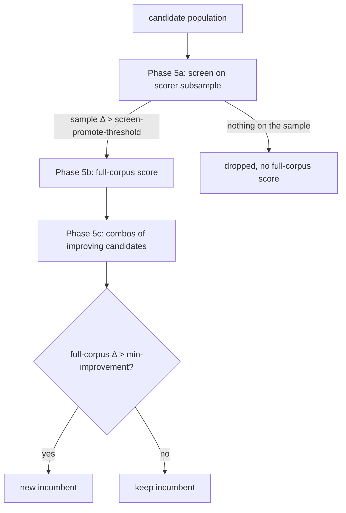

# Core-principle diagram now shows the screening phase (Issue #39)

## Summary

The README's core-principle diagram predated two-phase scoring: it sent the whole
candidate population straight into a single "NEAT-AI-scorer batch scoring" step,
which is not what the optimiser does. Scoring screens on a scorer subsample
first (`--screen-sample-rate`, default `0.05`) and only promotes candidates whose
sample Δ clears `--screen-promote-threshold` into a full-corpus batch; the rest
are dropped without ever costing a full-corpus score.

The diagram now shows both phases and the dropped branch, and the accompanying
line records that screening only filters — acceptance is still full-corpus only,
and `--screen-sample-rate 1` collapses the two phases back into one batch. The
issue's row is removed from the Outstanding work table. Closes #39.

## Evidence

Documentation-only change to `README.md`, so there is no UI to screenshot. The
correctness evidence is the README-contract test suite
(`lamarck/tests/readme_contract.rs`), which fails against the old diagram and
passes against the new one:

```text
running 10 tests
test core_principle_diagram_shows_screened_out_candidates_are_dropped ... ok
test core_principle_diagram_shows_two_phase_screening ... ok
test outstanding_work_no_longer_lists_the_core_principle_diagram ... ok
...
test result: ok. 10 passed; 0 failed
```

Before the README edit the same three tests failed:

```text
core-principle diagram omits "screen" — the screening phase is undocumented
core-principle diagram does not show candidates failing the screen being dropped
Outstanding work still lists issue #39 after the diagram was updated
```

The scoring path the diagram now matches:



`./quality.sh < /dev/null` passes cleanly (fmt, clippy, workspace tests, docs,
cargo-deny, codespell, shellcheck).

## Test Plan

Added to `lamarck/tests/readme_contract.rs`:

- `core_principle_diagram_shows_two_phase_screening` — the core-principle section
  names the subsample screen and the full corpus, in that order.
- `core_principle_diagram_shows_screened_out_candidates_are_dropped` — the
  screened-out branch is shown, not just the promoted one.
- `outstanding_work_no_longer_lists_the_core_principle_diagram` — the closed gap
  is no longer listed as outstanding.
- `section_returns_only_the_requested_section` and
  `section_panics_on_a_missing_heading` — happy path and error path for the new
  `section()` helper that scopes those assertions to one README section.

No existing tests were modified or removed.
