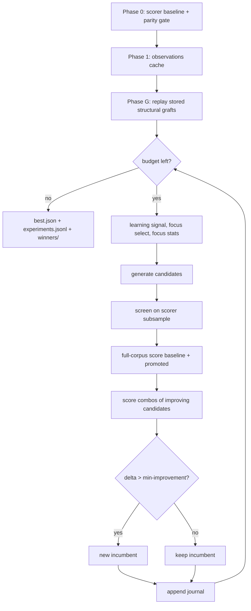

# PR Summary — Issue #40

## Summary

The README read as a project plan for a system that is now built: "Version 1
should answer…", "will contain", "proposed filename", and a phase-by-phase
specification written in the future tense. Rewritten in the present tense
against the code, so it documents the optimiser as it actually runs.
Closes #40.

What changed in `README.md`:

- **Status** section stating the spine is built and running, pointing at the
  measured economics in `docs/baseline-economics.md`.
- **Usage** with a worked production invocation and two flag tables. Four flags
  the binary accepts were undocumented: `--preserve-losers`,
  `--screen-promote-threshold`, `--grafts-path`,
  `--graft-replay-budget-seconds`.
- **How a run works** — a Mermaid lifecycle plus present-tense phase sections
  covering Phase 0 parity, the observations cache, **Phase G** structural graft
  replay (undocumented before), focus selection, focus analysis, the eight
  candidate strategies with the journal tag each writes, and the
  screen → promote → **combine** scoring path.
- **Outputs** and **Experiment journal** now list what the code writes
  (`best.json`, `experiments.jsonl`, `winners/`, per-experiment working
  directories; the real `ExperimentRecord` fields) rather than a proposed
  shape.
- **What we have learnt so far** replaces the open-questions-only section with
  the #8 baseline result, and marks which experimental questions remain
  unanswered.
- **Outstanding work** table — every gap between the old specification and the
  code, each with an issue.
- Repository layout corrected: `combos.rs` and `grafts.rs` were missing.

`docs/architecture.md` iteration lifecycle gained the graft-replay and
combo-scoring steps it was missing.

### Issues raised for what is outstanding

| Issue | Gap |
|-------|-----|
| [#70](https://github.com/stSoftwareAU/NEAT-AI-Lamarck/issues/70) | Journal omits the focus neuron's squash, incoming count, statistics and blame that the old spec promised. |
| [#71](https://github.com/stSoftwareAU/NEAT-AI-Lamarck/issues/71) | Without `--seed` the OS-drawn seed is never recorded, and no run configuration is journalled, so the run cannot be replayed. |
| [#72](https://github.com/stSoftwareAU/NEAT-AI-Lamarck/issues/72) | Two of the four documented stopping rules do not exist: no maximum experiment count, no cancellation handling. |
| [#73](https://github.com/stSoftwareAU/NEAT-AI-Lamarck/issues/73) | `observations.statistics` has no skewness/kurtosis and stores correlations but not covariances. |
| [#74](https://github.com/stSoftwareAU/NEAT-AI-Lamarck/issues/74) | `report` attributes wins by parsing `candidate-NNN` stems, so combo and graft accepts contribute zero to `strategies[].wins`. |
| [#75](https://github.com/stSoftwareAU/NEAT-AI-Lamarck/issues/75) | The follow-up economics experiments recommended by the #8 baseline have never been run. |

Existing [#39](https://github.com/stSoftwareAU/NEAT-AI-Lamarck/issues/39) (the
core-principle diagram predates screening) and
[#69](https://github.com/stSoftwareAU/NEAT-AI-Lamarck/issues/69) are listed in
the same table. The ASCII core-principle diagram is deliberately left untouched
here — it is #39's change.

## Evidence

Documentation and CLI change with no web interface, so there is no screenshot.
Evidence is the new contract test plus the full quality gate.

The new test fails against the pre-change README, naming the exact drift:

```text
---- readme_documents_every_cli_flag stdout ----
README.md does not document these CLI flags: ["--graft-replay-budget-seconds",
  "--grafts-path", "--preserve-losers", "--screen-promote-threshold"]
```

It also caught a fabricated flag while the rewrite was in progress — an
`--max-experiments` name mentioned for the not-yet-implemented stopping rule:

```text
---- readme_mentions_no_unknown_lamarck_flags stdout ----
README.md documents flags the binary does not accept: ["--max-experiments"]
```

After the rewrite:

```text
running 5 tests
test long_flags_handles_empty_input ... ok
test long_flags_extracts_flags_and_ignores_prose_dashes ... ok
test readme_documents_the_report_subcommand ... ok
test readme_documents_every_cli_flag ... ok
test readme_mentions_no_unknown_lamarck_flags ... ok

test result: ok. 5 passed; 0 failed
```

Full gate:

```text
./quality.sh < /dev/null
…
All quality checks passed!
```

`markdownlint-cli2` over the changed Markdown: `Summary: 0 error(s)`.

The run lifecycle the README now documents, as added to it:



## Test Plan

- Added `lamarck/tests/readme_contract.rs`:
  - `readme_documents_every_cli_flag` — every long flag in the binary's
    `--help` appears in `README.md` (this is the regression test for the four
    undocumented flags).
  - `readme_mentions_no_unknown_lamarck_flags` — every `--flag` in the README
    is either a real Lamarck flag or an explicitly listed foreign tool flag
    (`rust_scorer`, `cargo`, `pip`).
  - `readme_documents_the_report_subcommand` — the `report` subcommand stays
    documented.
  - `long_flags_extracts_flags_and_ignores_prose_dashes` and
    `long_flags_handles_empty_input` — the flag scanner's happy path, prose
    em-dash/short-flag edge cases, and empty input.
- No existing tests were modified or removed. `cargo test --workspace
  --all-features` passes (100 tests).
