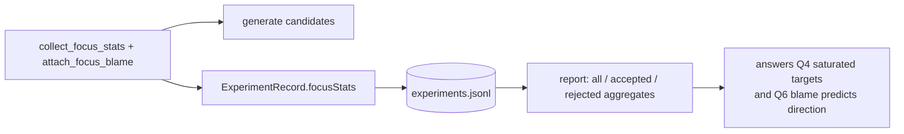

# Journal the focus neuron's structure, statistics and blame (Issue #70)

## Summary

`ExperimentRecord` recorded the focus neuron UUID but discarded the per-focus
analysis the loop had already computed, so a finished journal could not answer
experimental questions 4 ("are saturated/dead neurons good targets?") and 6
("does propagated blame predict a successful direction?"). This adds an optional
`focusStats` object to every experiment record, populated from the existing
focus scan (`collect_focus_stats` plus `attach_focus_blame`), and aggregates it
in `neat_ai_lamarck report`. Closes #70.

- `lamarck/src/run.rs` — `ExperimentRecord.focus_stats: Option<FocusNeuronStats>`
  (`focusStats`, omitted when absent), written at all five journal-append sites
  in the loop: the three scorer-failure paths, the empty-screen skip and the
  normal outcome. No new computation — the scan already ran.
- `lamarck/src/report.rs` — `JournalReport.focus_stats`, a `FocusStatsSummary`
  of three `FocusStatsAggregate` buckets (`all` / `accepted` / `rejected`)
  carrying mean incoming count, saturation and near-zero fractions,
  post-activation variance, mean **|blame|** (magnitudes, so signs cannot cancel
  out) and per-squash experiment counts. `null` for a journal with no focus
  statistics. `print_run_summary` prints the same split.
- `README.md` / `CHANGELOG.md` — journal-field table, `report` output
  description, and #70 removed from **Outstanding work**.

Backwards compatible: `focusStats` is `#[serde(default, skip_serializing_if)]`,
so journals written before this change still parse and report `focusStats: null`.



## Evidence

Backend/CLI change — no web interface to screenshot. Evidence is the test suite
plus real `report` output over a two-experiment journal (one accepted with a
saturated `TANH` focus, one rejected with a near-dead `IDENTITY` focus):

```console
$ neat_ai_lamarck report experiments.jsonl   # focusStats extract
"accepted": { "experiments": 1, "meanIncomingCount": 3.0,
              "meanSaturationFraction": 0.72, "meanNearZeroFraction": 0.0,
              "meanPostVariance": 0.11, "meanAbsBlame": 0.0021,
              "squashCounts": { "TANH": 1 } },
"rejected": { "experiments": 1, "meanIncomingCount": 1.0,
              "meanSaturationFraction": 0.0, "meanNearZeroFraction": 0.45,
              "meanPostVariance": 0.02, "meanAbsBlame": 4e-05,
              "squashCounts": { "IDENTITY": 1 } }
```

Test-first evidence: with the record field left unpopulated,
`run::tests::experiment_records_the_focus_structure_statistics_and_blame` fails
(`expect("every experiment carries the focus scan")`); populating it turns the
test green. `./quality.sh` passes end to end (fmt, clippy `-D warnings`,
cargo-deny, codespell, 134 tests, rustdoc).

## Test Plan

Added:

- `run::tests::experiment_records_the_focus_structure_statistics_and_blame` —
  runs the loop and asserts every journalled experiment carries the focus scan
  for the selected neuron (uuid, squash, incoming count, records scanned, output
  error, saturation fraction in range, blame present) and that the encoded
  journal uses the `focusStats` name.
- `report::tests::report_aggregates_focus_stats_by_outcome` — accepted and
  rejected experiments aggregate into the right buckets with the right means and
  squash counts.
- `report::tests::report_reports_no_blame_when_none_was_recorded` — a focus with
  no learning signal reports `meanAbsBlame: null` rather than a fabricated 0.
- `report::tests::report_omits_focus_stats_for_a_legacy_journal` — a record
  without focus statistics does not serialise the field and reports
  `focusStats: null`.
- `readme_contract::experiment_journal_documents_the_focus_stats_record`,
  `readme_contract::report_documents_the_focus_stats_aggregates`,
  `readme_contract::outstanding_work_no_longer_lists_the_focus_journal_gap`.

Modified: existing `report` tests gained the new record field (`focus_stats:
None`) and now share `experiment()` / `journal_of()` helpers. No test was
removed or disabled.
