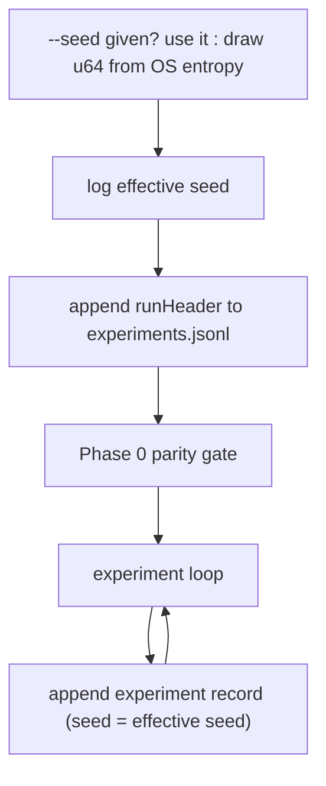

## Summary

A run without `--seed` used `StdRng::from_os_rng()` and never captured the drawn
value, so the journal recorded `seed: null` and the run could not be replayed;
the journal also carried no run configuration at all. Lamarck now draws an
explicit `u64` seed when `--seed` is omitted, logs it, uses it for both the main
RNG and the per-experiment backprop RNG, and writes a one-off `runHeader` line to
`experiments.jsonl` carrying the effective seed, its source and the knobs needed
to reproduce the run. Every experiment record now carries the effective seed
instead of `null`. Closes #71.

- `RunHeaderRecord` / `RunConfigRecord` / `SeedSource` / `JournalLine` in
  `lamarck/src/run.rs`; the header is written before the Phase-0 gate so a run
  that fails the gate still records its configuration.
- The per-experiment backprop RNG previously derived from `config.seed.unwrap_or(0)`
  — a constant for unseeded runs — and now derives from the effective seed.
- `RunResult` gained `seed`, and the run summary prints
  `seed: N (replay with --seed N)`.
- `report_from_journal` dispatches on the `record` discriminator and skips the
  header; a line that is neither a valid header nor a valid experiment is a hard
  error, never a silently empty run.
- README: the reproducibility contract now states that the RNG stream repeats but
  the wall-clock-bounded experiment count may not, plus the `runHeader` field
  table; #71 removed from **Outstanding work**.

## Evidence

Backend/CLI change — no web interface to screenshot. Verified end to end against
the real `rust_scorer` binary on a synthetic 200-record corpus.

Unseeded run logs and records the drawn seed:

```text
● seed 13562772100821933948 (drawn from OS entropy; replay this run with --seed 13562772100821933948)
```

First line of the resulting `experiments.jsonl`:

```json
{"record":"runHeader","timestampUnix":1786372492,"seed":11996507478086430568,"seedSource":"drawn","version":"0.1.2","config":{"creature":"…/creature.json","trainingData":"…/data","scorerPath":"../NEAT-AI-scorer/target/release/rust_scorer","timeoutSeconds":5,"candidates":4,"minImprovement":1e-6,"screenSampleRate":0.05,"screenPromoteThreshold":1e-6,"focusNeuron":null,"focusPolicy":"weighted","statsMode":"quick","quickSampleRecords":25000,"computeCorrelations":false,"structuralOnly":false,"phase0Parity":true,"preserveLosers":false,"maxConsecutiveScorerFailures":3,"graftsPath":null,"graftReplayBudgetSeconds":null}}
```

Replaying that seed reproduces the candidate stream, and `report` still parses
the journal:

```text
experiment seed: 13562772100821933948 == 13562772100821933948
focus: o1 o1
candidates identical: True
report → "experiments": 247   (header line not counted)
```

Where the header lands in the run:



`./quality.sh` passes (fmt, clippy `-D warnings`, cargo-deny, 109 tests, docs).

## Test Plan

Added (`lamarck/src/run.rs`):

- `unseeded_run_records_effective_seed` — an unseeded run writes a `runHeader`
  whose `seed` matches `RunResult::seed` with `seedSource: drawn`, and every
  experiment record repeats that seed.
- `run_header_records_run_configuration` — the header carries the version and
  each config knob (paths, timeout, candidates, min improvement, screen
  rate/threshold, focus neuron/policy, stats mode, quick sample size,
  `structuralOnly`, `phase0Parity`, grafts path, failure cap) and encodes the
  `"record":"runHeader"` discriminator.
- `recorded_seed_replays_the_candidate_stream` — the regression test for the
  issue: run unseeded, feed the recorded seed back as `--seed`, and the first
  experiment's focus and candidate provenance stream are identical.

Added (`lamarck/src/report.rs`):

- `report_skips_the_run_header_line` — a journal with a header plus one
  experiment reports one experiment.

Modified (documented, both are journal-format updates, not weakened assertions):

- `loop_accepts_winner_and_writes_journal` — now asserts line 1 is the
  `runHeader` and line 2 is the first experiment.
- `screen_empty_skips_full_corpus_score` — reads the first *experiment* line
  rather than the first line of the file.
