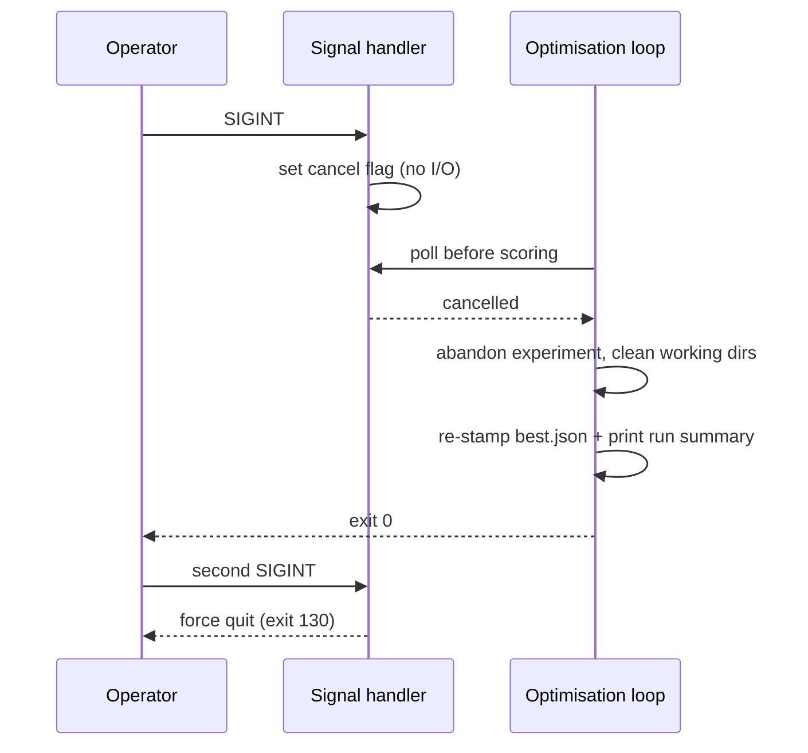

# Add `--max-experiments` and graceful cancellation (Issue #72)

## Summary

The README's Phase 6 listed four stopping rules but only two existed: the
wall-clock timeout and the consecutive-scorer-failure abort. There was no signal
handling anywhere in `lamarck/src`, so `SIGINT` killed the process
mid-experiment — the final run-summary re-tag of `best.json` never ran and the
experiment's working directories were left behind.

This adds the two missing rules:

- **`--max-experiments <N>`** — a hard cap checked in the loop condition,
  recorded in the journal `runHeader` as `maxExperiments` so a capped run stays
  replayable.
- **Graceful cancellation** — a new `lamarck/src/cancel.rs` installs
  `SIGINT`/`SIGTERM` handlers that only set an `AtomicBool` (`CancelToken`). The
  loop polls it before the next experiment and again before the expensive
  scoring phase, so a signal during analysis abandons the in-flight experiment
  before any working directory is written, and one during scoring stops the loop
  after that experiment is journalled. Either way `best.json` is re-stamped with
  the run-summary tag, the summary prints, and the process exits `0`. A second
  signal force-quits with `130` for a run wedged inside a long scorer batch.

`RunResult` now carries a `StopReason` (`timeout` / `max-experiments` /
`cancelled`), printed by the run summary as `stopped on:`. `run_optimisation`
keeps its signature and delegates to the new `run_optimisation_cancellable`.

The Unix-only `signal-hook` dependency is declared under
`[target.'cfg(unix)'.dependencies]` with default features off; `cargo deny`
passes (MIT OR Apache-2.0). A handler that cannot be installed is fatal at
startup rather than leaving cancellation silently wired to nothing.

Closes #72.

## Evidence

Backend/CLI change — no web interface to screenshot. Verified end to end against
the real binary and a stand-in scorer script (a slow, flat-scoring
`rust_scorer`), plus the unit tests below.



**`--max-experiments 2` inside a 600-second budget** — the cap, not the clock,
ends the run:

```text
● experiment cap reached (2) — stopping
● run summary
  experiments:  2  (accepted 0  scorer_ok 2  scorer_fail 0)
  stopped on:    max-experiments
```

**`SIGINT` during a scorer batch** — the experiment finishes, the run summary
prints, the process exits `0` and no `candidates-exp-N/` directory survives:

```text
⚠ cancellation requested — stopping before the next experiment
● run summary
  experiments:  2  (accepted 0  scorer_ok 2  scorer_fail 0)
  stopped on:    cancelled
  best.json:     out/best.json
exit code: 0
$ ls out
best.json
experiments.jsonl
```

**Second `SIGINT`** while the scorer is still running:

```text
second-signal exit code: 130
```

`./quality.sh` passes (fmt, clippy `-D warnings`, `cargo deny`, 143 tests,
rustdoc).

## Test Plan

New tests, all calling the real functions:

- `lamarck/src/cancel.rs`
  - `a_new_token_is_not_cancelled`, `cancel_sets_the_flag`,
    `cancelling_is_idempotent`, `clones_share_one_flag`,
    `another_thread_can_cancel` — the token contract.
  - `sigint_cancels_the_token_instead_of_terminating` — raises a **real**
    `SIGINT` at the test process and asserts the token flips instead of the
    process dying.
- `lamarck/src/run.rs`
  - `max_experiments_caps_the_loop` — 300-second budget, cap of 2: asserts
    exactly two experiments run and are journalled, `stopReason` is
    `MaxExperiments`, and the header records the cap.
  - `a_zero_experiment_cap_runs_nothing` — a cap of `0` is a clean no-op, not an
    underflow of the experiment counter.
  - `cancellation_stops_the_loop_and_still_stamps_best` — a scorer that cancels
    mid-batch: one experiment journalled, `best.json` carries the run-summary
    `lamarck` tag, and no working directories are left behind.
  - `cancellation_before_the_first_experiment_runs_none` — a pre-cancelled token
    runs zero experiments and leaves `best.json` as the verbatim copy of the
    supplied creature.
- `lamarck/tests/readme_contract.rs`
  - `phase_six_documents_every_stopping_rule`,
    `phase_six_documents_the_graceful_cancellation_contract`,
    `outstanding_work_no_longer_lists_the_stopping_rules_gap`.

Modified: `loop_accepts_winner_and_writes_journal` gained one assertion
(`stop_reason == Timeout`); every in-test `LamarckConfig` literal gained
`max_experiments: None`. No test was removed or disabled.
