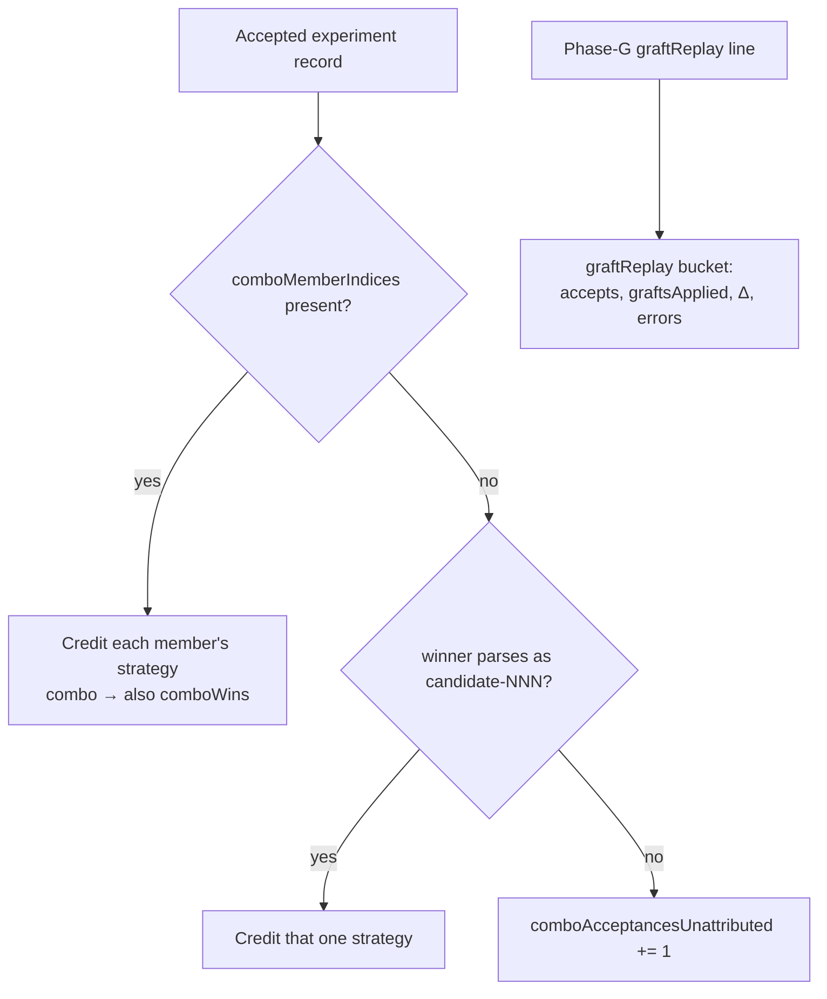

# Attribute combo and graft wins to a strategy (Issue #74)

## Summary

`report` attributed a win by parsing the winning stem as `candidate-<index>`, so
a merged combo winner (`combo-NNN-kM`, since #63) contributed nothing to
`strategies[].wins`, and a Phase-G graft accept — which has no candidate stem at
all, and was never journalled — vanished entirely. Every strategy family that
only wins inside a merge was therefore under-reported. Closes #74.

The journal did not in fact carry enough to fix this in the reader alone:
`comboMembers` is a member *count*, not the members. So:

- **Journal.** An acceptance now records `comboMemberIndices` — the candidate
  indices behind the winner (one entry for a single, several for a combo).
  Phase-G writes its own `graftReplay` line (`graftsApplied`, `accepted`,
  `baselineScore`, `score`, `improvement`, `elapsedMs`, scorer counters, and
  `replayError` when the phase aborted). `JournalLine::parse` dispatches on the
  `record` discriminator and now rejects an unknown kind loudly instead of
  mis-reading it as an experiment.
- **Report.** A combo win is credited to **every** member strategy, with the
  merge-earned subset carried per row as `comboWins`; `wins` therefore sums to
  more than `acceptances` when combos win. A pre-#74 combo win names no members
  and is counted in `comboAcceptancesUnattributed` rather than being dropped
  silently. Phase-G gets its own `graftReplay` bucket (`replays`, `accepts`,
  `graftsApplied`, `cumulativeImprovement`, `scorerFailures`, `replayErrors`),
  `null` for journals with no replay line. The run summary prints both.

Backwards compatible: both fields are optional, and a journal without them falls
back to the old `candidate-NNN` stem parse.

## Evidence

Backend/CLI change — no web interface to screenshot. Verified end to end by
running the real subcommand over a journal carrying a `graftReplay` line and a
`combo-000-k2` win whose members are candidates 0 (`random`) and 1 (`backprop`),
with candidate 2 (`stats_weight`) a non-member:

```console
$ cargo run -- report /tmp/j74.jsonl
  "strategies": [
    { "strategy": "backprop",     "wins": 1, "comboWins": 1, "appearancesTotal": 1, "acceptanceRate": 1.0 },
    { "strategy": "random",       "wins": 1, "comboWins": 1, "appearancesTotal": 2, "acceptanceRate": 0.5 },
    { "strategy": "stats_weight", "wins": 0, "comboWins": 0, "appearancesTotal": 1, "acceptanceRate": 0.0 }
  ],
  "comboAcceptances": 1,
  "comboAcceptancesUnattributed": 0,
  "graftReplay": {
    "replays": 1, "accepts": 1, "graftsApplied": 2,
    "cumulativeImprovement": 3e-06, "scorerFailures": 0, "replayErrors": 0
  }
```

Before this change the same journal reported `wins: 0` for every strategy, and
the `graftReplay` line did not exist to report at all.

Where an accepted win is attributed from:



`./quality.sh` passes: fmt, clippy `-D warnings`, cargo-deny, codespell, 158
tests, rustdoc.

## Test Plan

Added (all fail against the unfixed reader — combo wins were never credited, and
the replay record did not exist):

- `report.rs::report_attributes_a_combo_win_to_every_member_strategy` — a
  `combo-000-k2` win credits both members and neither credits nor infects the
  non-member.
- `report.rs::report_attributes_a_single_win_to_one_strategy` — a single win is
  credited once and is not counted as a combo win.
- `report.rs::report_counts_an_unattributable_legacy_combo_win` — a pre-#74
  combo win is counted as unattributed, and no strategy is guessed at.
- `report.rs::report_buckets_graft_replay_accepts` — the replay line is bucketed
  and is not counted as an experiment.
- `report.rs::report_surfaces_a_failed_graft_replay` — an aborted replay reports
  `replayErrors: 1` instead of passing as clean.
- `report.rs::report_omits_the_graft_bucket_without_a_replay_line` — no bucket
  for a journal with no replay.
- `run.rs::phase_g_accept_is_journalled_as_a_graft_replay_record` — a real
  Phase-G run writes the `graftReplay` line, and `report` buckets it.
- `run.rs::an_accepted_winner_journals_its_member_indices` — a real accepting
  run records member indices that address the journalled candidates.
- `readme_contract.rs` — three tests pinning the new journal fields, the
  attribution rule, and the removal of #74 from Outstanding work.

Modified: the Phase-G fixture in `run.rs` was extracted into a
`graft_replay_run` helper shared by the existing replay test and the new one —
no assertion was removed. Existing record literals gained the new optional
field.
