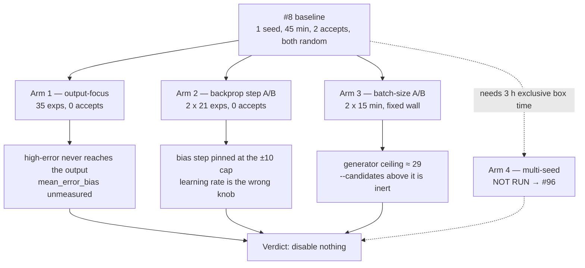

# Run the follow-up economics experiments recommended by the #8 baseline

## Summary

`docs/baseline-economics.md` closed #8 with a single 45-minute, single-seed run
and four "recommended next experiments" that were never run, leaving the
strategy table a one-sample result. This PR runs them on the production GRQ
creature and records the results in `docs/followup-economics.md`. Closes #75.

Three of the four arms ran — 118 further experiments, ~78 minutes of exclusive
scorer time — and two of them found something the arms were not looking for:

- **Arm 2 (backprop step A/B) is a null result with a cause.** Learning rates
  0.01 and 0.001 produced *the same bias candidate to the last digit*, because
  the focus carried mean `|blame|` ≈ 2.3e13 and the proposal saturates
  `BackpropConfig::maximum_bias_adjustment_scale` (10.0) at either rate. A ±10
  bias step against a `1e-6` accept bar is ~7 orders of magnitude too coarse.
  `--backprop-learning-rate` is the wrong knob; the cap is the one that binds.
- **Arm 3 (batch-size A/B) could not be run as specified.** Candidate
  generation has a fixed per-phase ceiling — 29 on this creature — so 40, 100
  and 150 all fill the identical batch. The arm was run at a budget that
  actually binds (12) against one at the ceiling (40).

**Verdict: no strategy is disabled.** The strategies that came closest to the
accept bar here were `stats_weight` (+8.39e-7) and `structural_add` (+3.90e-7),
not #8's `random` (worst full-corpus Δ of the campaign at -1.06e-4), so the
single-sample ordering in `docs/baseline-economics.md` is not stable enough to
deprioritise anything. `mean_error_bias` and `stats_skew_bias` remain
**unmeasured** — zero appearances in 118 experiments, because no arm reached an
output focus.

Also shipped: `--backprop-learning-rate` (validated; a non-positive or
non-finite value aborts the run rather than silently reverting to the default,
and the value is journalled in `runHeader`), the campaign runner and
summariser, and a doc↔code contract test so the write-up cannot outlive the
strategies it discusses.

Arm 4 (the multi-seed repeat, 4 × 45 min of exclusive box time), the
`--focus-neuron output-0` slice and the backprop *cap* A/B all need exclusive
use of the production creature and are tracked in one follow-up,
[#96](https://github.com/stSoftwareAU/NEAT-AI-Lamarck/issues/96).

## Evidence

Backend/CLI change — no web interface to screenshot. The evidence is the
campaign itself.

Raw artefacts stay out of the repo by design (journals are gitignored); each
arm wrote its own `experiments.jsonl`, `report.json`, `run.log` and
`timing.txt` under `.lamarck-followup/<arm>/`, and every table in
`docs/followup-economics.md` is regenerable with
`scripts/summarise-followup-economics.sh`.

## Test Plan

Added:

- `lamarck/src/candidates.rs::tests::a_saturating_blame_mass_pins_the_bias_step_to_the_cap_whatever_the_rate`
  — pins Arm 2's finding: at a production-scale blame mass the proposed bias
  step is identical for 0.01 and 0.001 and sits on the ±10 cap, while a small
  blame mass still scales with the rate (so the knob is not inert in general).
- `lamarck/src/candidates.rs::tests::raising_the_candidate_budget_above_the_generator_ceiling_adds_nothing`
  — pins Arm 3's finding: budgets of 40, 100 and 150 fill the same batch, and a
  budget under the ceiling does bind.

From the earlier commits on this branch:

- `lamarck/src/config.rs::tests` — `backprop_config()` keeps the port default
  when unset, applies an override to both rate fields, proposes a
  proportionally larger step at a larger rate, and rejects a non-positive or
  non-finite rate loudly instead of falling back.
- `lamarck/tests/followup_economics_doc.rs` — the doc↔code contract: the
  write-up covers all four arms, its verdict rules explicitly on every
  `CandidateStrategy` the binary can generate, it names no strategy the binary
  cannot generate, the README points at the results, and the runner script can
  drive every arm.

`./quality.sh` passes (fmt, clippy `-D warnings`, cargo-deny, codespell,
shellcheck, full test suite, rustdoc).
