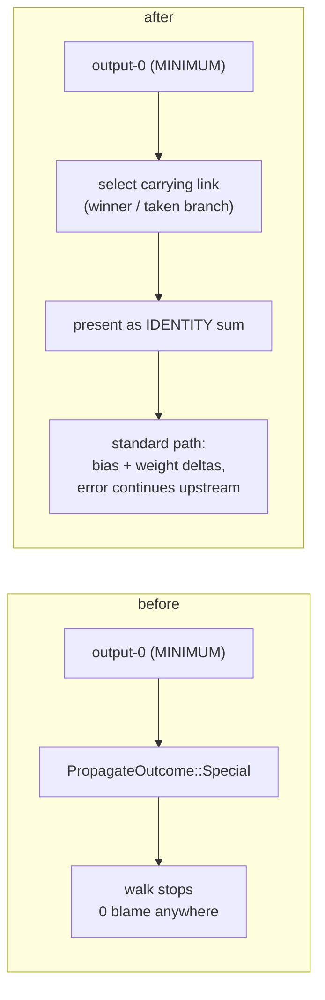

# backprop: route blame through aggregate neurons, drop the fallback step

## Summary

`backprop` had never produced an accepted candidate (0 wins in 384 appearances)
because the learning signal it proposes from was empty. neat-core's
reverse-topological loop hands aggregate squashes (`MINIMUM` / `MAXIMUM` / `IF`)
back as `PropagateOutcome::Special` and stops — the TypeScript trainer runs a
per-squash custom `propagate` instead, and Lamarck did nothing. The production
GRQ creature (`../GRQ-cluster/network.json`, the #8 / #75 creature) has a
`MINIMUM` output, so the walk ended at the first neuron and **no** neuron ever
accumulated blame.

Two changes:

1. **Aggregates are linearised per record** (`lamarck/src/propagate_layout.rs`).
   Each aggregate neuron is presented to the generic loop as an `IDENTITY` sum
   over exactly the links that produced that record's activation — the winning
   link for `MINIMUM` / `MAXIMUM`, the taken branch for `IF` (condition links
   gate the branch and never carry its error). This mirrors the TypeScript
   custom `propagate` routing without duplicating neat-core's loop.
2. **`backprop` is skipped when no blame reached the focus**
   (`lamarck/src/candidates.rs`). The old residual fallback ran the mean
   adjusted error through both the `0.1` step fraction *and* the `0.01`
   learning rate, landing ~200x below the scale accepted candidates move at —
   a strictly worse duplicate of `mean_error_bias`. The batch slot now goes to
   a strategy that can clear `--min-improvement`.

Closes #83.

## Evidence

Backend/CLI change — no web interface to screenshot. Measured against the
production creature (2511 inputs, 1600 neurons, 21 889 synapses, `MINIMUM`
output) over 64 records, via a scratch harness calling
`accumulate_creature_learning` directly (harness deleted before commit):

| Learning signal | Before | After |
|-----------------|--------|-------|
| Neurons with accumulated blame | **0 / 1600** | `output-0` (64 records) + the upstream `IF` hidden (38 records) |
| Synapses with a weight signal | **0 / 21 889** | 3 |

The creature's output has only two inward links (one raw input, one hidden), so
the reachable chain is short by topology — but `output-0`, the focus pinned in
the #75 arm that produced 159 fallback candidates, now carries real blame
instead of none.

`./quality.sh` passes (fmt, clippy `-D warnings`, cargo-deny, codespell, 163
tests, rustdoc).

## Test Plan

Added (all fail against the unfixed code, except the last two which pin the new
gate):

- `propagate_layout::tests::minimum_output_propagates_blame_to_the_winning_branch`
  — `min(h1, h2)` output: the winning branch accumulates bias and weight
  signals, the losing branch stays at zero.
- `propagate_layout::tests::maximum_output_propagates_blame_to_the_winning_branch`
  — same for `MAXIMUM`, with the other branch winning.
- `propagate_layout::tests::if_output_propagates_blame_to_the_taken_branch_only`
  — `IF` output: the taken branch is blamed; the untaken branch and the
  condition link are not.
- `candidates::tests::backprop_without_a_learning_signal_proposes_nothing` —
  no signal, and an all-zero signal, both produce no candidate.
- `candidates::tests::backprop_proposes_from_an_accumulated_bias_signal` — a
  real accumulated signal still produces a `backprop` candidate.

Existing suites (backprop parity fixtures, README contract, candidate
determinism) are unchanged and still pass.
