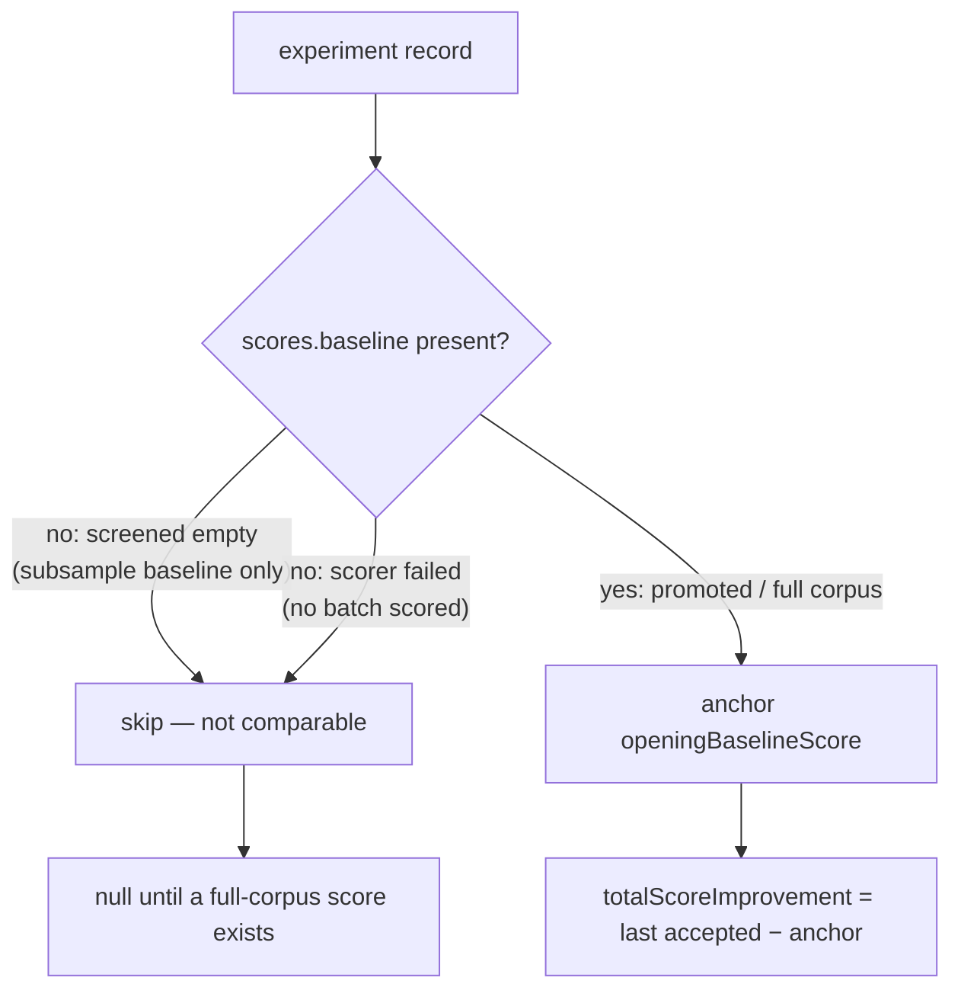

# report: anchor `openingBaselineScore` on a full-corpus score (Issue #84)

## Summary

`report_from_journal` anchored `openingBaselineScore` on the **first** experiment
record's `baselineScore`. When a candidate batch screens empty, that field is the
screen (5% sample) baseline, not an authoritative score. With `--skip-phase0`
there is no Phase-0 anchor either, so the opening was whatever the first
experiment happened to sample — a number that swings by roughly `5e-3`, about
5000x the `1e-6` accept threshold. `totalScoreImprovement` (best − opening) was
therefore subtracting two different quantities, and the `batch-020` arm reported
`-4.473e-04` for a run that only ever accepted `+1.322e-6` and `+1.724e-6`.

The anchor is now the `scores.baseline` of the first experiment that actually
promoted to full-corpus scoring. That is the same number Phase-0 measures when it
runs, because the incumbent cannot change before the first acceptance. Until such
a score exists, `openingBaselineScore`, `totalScoreImprovement` and
`relativeScoreImprovement` are `null` rather than a sampling artefact — a reader
can no longer mistake a screen-sample swing for a regression.

Scope: `report` only. The run loop already anchored its in-process
`opening_baseline_score` on Phase-0 / the first full-corpus baseline
(`lamarck/src/run.rs:1238`), and `print_run_summary` already prefers that value.

Closes #84.

## Evidence

Backend/CLI change — no web interface to screenshot. Evidence is the test suite:
each new test fails against the unfixed anchor and passes with it.

Against the unfixed code (anchor restored to `record.baseline_score`):

```text
test report::tests::report_anchors_the_opening_baseline_on_a_full_corpus_score ... FAILED
test report::tests::report_leaves_the_opening_baseline_null_without_a_full_corpus_score ... FAILED
test report::tests::report_skips_a_scorer_failure_when_anchoring_the_opening_baseline ... FAILED
test result: FAILED. 11 passed; 3 failed
```

With the fix:

```text
test result: ok. 14 passed; 0 failed; 0 ignored; 0 measured; 123 filtered out
```

`./quality.sh` passes end to end (fmt, clippy `-D warnings`, cargo-deny,
codespell, full workspace tests, rustdoc).

Which journal records may anchor the opening baseline:



## Test Plan

Added to `lamarck/src/report.rs` tests:

- `report_anchors_the_opening_baseline_on_a_full_corpus_score` — regression test
  for the reported shape: a screened-empty experiment (higher sample baseline)
  followed by promoted experiments with two accepts. Asserts the anchor is the
  promoted full-corpus baseline and the total is the `+3.046e-6` actually
  accepted, not a negative sampling artefact.
- `report_leaves_the_opening_baseline_null_without_a_full_corpus_score` — a
  journal of screened-empty experiments only reports `null` for all three fields.
- `report_skips_a_scorer_failure_when_anchoring_the_opening_baseline` — a failed
  batch carries no full-corpus score, so the anchor comes from the next
  experiment that promoted.

No existing test was modified or removed.

Docs updated in the same change: the `report` section of `README.md` states the
anchoring rule, and `CHANGELOG.md` records the fix under **Unreleased → Fixed**.
