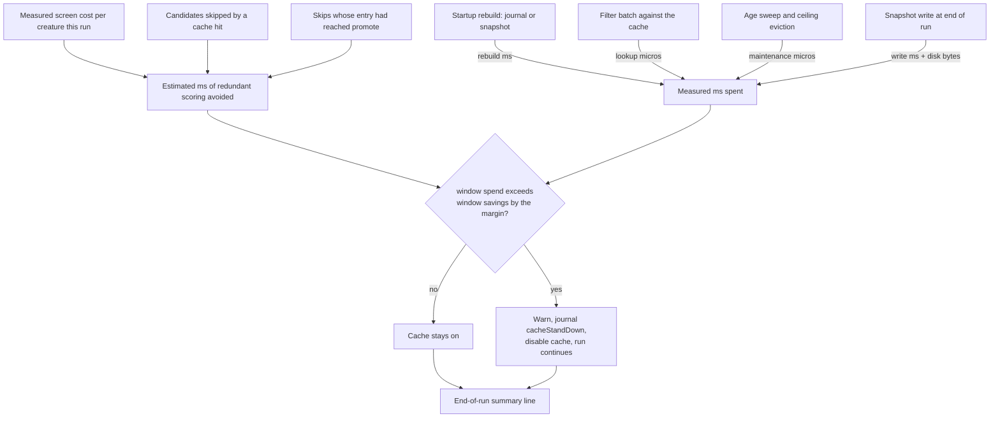

# Failed-candidate cache: overhead accounting and stand-down (Issue #92)

## Summary

The hard constraint on #69 — the failed-candidate cache must not spend more time
than it saves, and must not grow without bound — is now enforced in the code
rather than asserted in a benchmark report. The cache keeps a ledger of both
sides, journals it per experiment, and stands itself down when it stops paying.
Closes #92.

- **New `lamarck/src/failed_cache/economics.rs`.** Savings are *estimated* from
  this run's own measured screen cost (`skipped × mean screen ms per scored
  creature`, dividing by every creature the batch scored so the baseline cannot
  inflate the figure), never from a constant. With screening off, the single
  full-corpus batch is that first phase and is priced as such. Promote-phase
  time is claimed only for a skip whose cache entry records the candidate as
  having actually been promoted; every other skip is screen-cost only, so the
  estimate under-claims rather than over-claims. Only a genuine cache hit counts
  as a skip — a proposal dropped for repeating one already in the same batch is
  the generator's doing and is reported separately, so it cannot inflate the hit
  rate or the savings. Spend is *measured* — lookup, maintenance, the startup
  rebuild and the snapshot write — and accumulated in **microseconds**, because
  a whole-millisecond timer truncates a small batch's overhead to zero and an
  overhead that rounds to zero would let a losing cache look free.
- **`savedMs` is redundant scoring avoided, not wall clock removed.** The batch
  is backfilled to full width (#91: the scorer batch is the unit of cost), so a
  replaced skip buys fresh exploration rather than a shorter batch. `savedMs` is
  the quantity #69's constraint is stated in and is what the guardrail judges;
  the part that genuinely shortened the scorer's work — skips the backfill could
  not replace — is reported separately as `wallClockSavedMs` so the two are
  never conflated.
- **Stand-down.** The guardrail judges a **rolling window** of the most recent
  `--failed-cache-stand-down-window` (default `20`) experiments: when the spend
  inside that window exceeds the savings inside it by
  `--failed-cache-stand-down-margin-ms` (default `1000`), Lamarck logs a
  warning, writes a `cacheStandDown` journal line and disables the cache for the
  remainder of the run — which continues, and writes no snapshot. One-off costs
  count in the run's cumulative ledger but not in the window: they are sunk
  before it opens, and disabling a currently-profitable cache cannot un-spend
  them. A cache that does not earn its keep degrades to today's cache-off
  behaviour instead of degrading the run.
- **Byte ceiling.** `--failed-cache-max-bytes` (default ~25 MiB, the entry cap's
  own worst case) bounds the resident footprint; past it the cache evicts
  oldest-first and **logs the bite**, because a silently truncated cache reads as
  a working cache.
- **Reporting.** Each experiment journals `cacheSavedMs`, `cacheSpentMs`,
  `cacheNetCumulativeMs` and `cacheResidentBytes`; every cache-on run ends with
  one parseable summary line (entries, hit rate, ms saved, ms spent, net, peak
  memory bytes, disk bytes). The `runHeader` records the guardrail knobs so an
  arm is identifiable from its journal alone.

Cross-run aggregation in `report` and the production A/B remain out of scope —
they are the last two sub-issues of #69.

## Evidence

Backend/CLI change with no web interface, so there is no screenshot to capture.
The evidence is the test suite plus `./quality.sh`, which passes cleanly
(fmt, clippy `-D warnings`, cargo-deny, 275 tests across the workspace —
including the 8 new ones in `tests/cache_economics.rs` — and rustdoc
`-D warnings`).



The end-of-run line downstream tooling parses:

```text
● failed-cache economics: entries=1240 hitRate=0.1832 savedMs=48210.5 wallClockSavedMs=0.0 spentMs=311.2 netMs=47899.3 peakMemoryBytes=634880 diskBytes=98304 standDown=false ceilingBites=0
```

## Test Plan

New integration suite `lamarck/tests/cache_economics.rs` — the failure-detection
points the issue names:

- `accounting_matches_known_inputs` — fixed skip counts, screen/promote samples
  and lookup/maintenance/rebuild/snapshot costs produce exact saved/spent/net,
  hit-rate, wall-clock-saved and footprint figures, including that promote
  savings accrue *only* to previously-promoted skips and that only skips the
  backfill could not replace count as wall clock. Any drift in the estimator
  fails here first.
- `net_negative_run_disables_cache` — a run whose scorer costs nothing (so every
  skip is worth nothing) warns, journals exactly one `cacheStandDown` carrying
  the logged message, leaves every later experiment without cache fields, writes
  no snapshot, and still completes normally.
- `net_positive_run_keeps_cache_enabled` — the inverse guard against an
  over-eager stand-down silently reverting the feature: with a 30 ms batch the
  savings dwarf the lookup cost, nothing stands down and the snapshot is written.
- `ceiling_evicts_and_logs` / `under_ceiling_run_does_not_evict` — 50 entries
  against an 8-entry ceiling evict 42, leave the footprint at or under the
  ceiling and produce a reportable bite; a cache inside its ceiling evicts
  nothing but is still measured.
- `a_warm_cache_above_the_ceiling_is_evicted_at_startup` — a second run over the
  same output directory, under a tighter ceiling, brings the restored snapshot
  under the bound before the loop starts rather than after the first insert.
- `end_of_run_summary_line_carries_every_field` — asserts every field name on the
  summary line of a real run.
- `cache_off_run_has_no_ledger` — a cache-off run journals no economics fields at
  all.

Unit tests added alongside the code:

- `failed_cache::economics::tests` — measured-not-constant screen pricing,
  promote-only-when-promoted, sub-millisecond spend not rounded away, the whole
  window having to lose (a win inside it carries the losses),
  `a_sunk_startup_cost_does_not_condemn_a_profitable_cache`,
  `stand_down_window = 0` opting out, ceiling behaviour, and the summary-line
  shape.
- `failed_cache::store::tests::a_promoted_failure_is_reported_by_the_hit_and_snapshotted`
  — the `promoted` flag survives lookup and snapshot, and a later promote of an
  already-known screen failure does not upgrade it (under-claim, not over-claim).
- `failed_cache::filter::tests::a_filtered_batch_separates_previously_promoted_skips`,
  and `backfill_deduplicates_against_the_batch_it_is_filling` now also asserts an
  intra-batch repeat is *not* credited to the cache as a skip.
- `failed_cache::rebuild::tests::only_a_two_phase_record_replays_a_promoted_entry`
  — a run with screening off has no promote phase to have reached, so its scores
  must not be replayed as promoted.
- `run::tests::cache_on_journals_per_experiment_economics` — per-experiment
  ledger fields are journalled, the footprint equals entries × entry size, and
  the guardrail knobs are in the `runHeader`.
- `config::tests::the_economics_guardrail_is_configured_by_default`.

Existing tests were updated for the new `insert_failures` promoted argument, the
new config fields and the new `JournalLine::CacheStandDown` variant; none were
removed or weakened.
