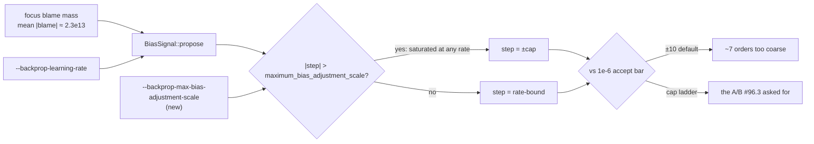

# Wire up the three exclusive-box economics arms (Issue #96)

## Summary

Issue #96 listed three economics measurements left over from #75. Two of them
had no way to be run at all, and the third needed a CLI knob that did not exist.
This PR builds the missing machinery and leaves the runs themselves — which need
the production creature, the production scorer and ~4.5 hours of *exclusive* box
time — tracked in
[#98](https://github.com/stSoftwareAU/NEAT-AI-Lamarck/issues/98). Closes #96.

What changed:

- **`--backprop-max-bias-adjustment-scale`** (item 3). The #75 learning-rate A/B
  returned identical bias candidates because a saturating blame mass pins the
  step to `BackpropConfig::maximum_bias_adjustment_scale` (10.0) at *every*
  rate. The cap is therefore the knob the A/B needs. The flag mirrors
  `--backprop-learning-rate`: validated loudly (non-positive or non-finite
  aborts before the scorer is spawned rather than silently reverting to `10`)
  and recorded in the journal `runHeader`, so an arm is identifiable from its
  journal alone.
- **`output-neuron` arm** (item 2). Pins `--focus-neuron output-0`
  (`OUTPUT_NEURON` overrides it). #75 established that `--focus-policy
  high-error` ranks by error-influence mass and never leaves the hidden layer on
  this creature, so the only way to the output residual — and therefore to
  `mean_error_bias` / `stats_skew_bias`, which have zero appearances in 118
  experiments — is a pinned focus.
- **`backprop-cap` arm** (item 3). A cap ladder (`10 0.01 0.000001`, override
  with `BACKPROP_CAPS`) on one seed, so only the cap moves.
- Neither new arm joins the runner's default arm set. Like `multi-seed` they
  need exclusive use of the scorer, and a second run beside them corrupts every
  per-minute figure the campaign exists to measure.

The measurements are **not** in this PR: no worker box has the production
creature, the production scorer or 4.5 hours of exclusive time. That work is
issue [#98](https://github.com/stSoftwareAU/NEAT-AI-Lamarck/issues/98), which
carries the exact commands and prerequisites.

## Evidence

Backend/CLI change — no web interface to screenshot. Evidence is the test suite
plus `./quality.sh`, which passes clean (fmt, clippy `-D warnings`, cargo-deny,
codespell, 195 tests, rustdoc).

Where the cap sits in a run, and why the rate could not move it:



Arm dispatch, driven end to end against a stub optimiser in
`lamarck/tests/followup_economics_arms.rs`:

```text
output-neuron : --timeout-seconds 1200 --candidates 100 --seed 41 --focus-neuron output-0
backprop-cap  : ... --seed 51 --focus-policy weighted --backprop-max-bias-adjustment-scale 10
                ... --seed 51 --focus-policy weighted --backprop-max-bias-adjustment-scale 0.01
                ... --seed 51 --focus-policy weighted --backprop-max-bias-adjustment-scale 0.000001
```

### Pre-PR security self-check

- Input validation: the new flag is validated (finite, `> 0`) before any
  subprocess is spawned; an invalid value aborts with a non-zero exit.
- No secrets, `.config*.json` or hidden files staged.
- No new injection surface: the cap is a parsed `f64` passed to a struct field,
  never interpolated into a command line.
- Error handling: failures name the flag and nothing about the environment.
- No new dependencies.

## Test Plan

New tests (all call real functions/binaries and assert on results):

- `config::tests::backprop_config_keeps_the_port_default_bias_cap_when_unset`
- `config::tests::backprop_config_applies_the_bias_cap_override` — and leaves
  the weight cap alone, so the A/B is not confounded
- `config::tests::a_smaller_cap_shrinks_a_blame_saturated_bias_step` — the
  proposed step tracks the cap across `10`, `0.01`, `1e-6`
- `config::tests::a_non_positive_or_non_finite_cap_is_rejected_loudly`
- `candidates::tests::lowering_the_bias_cap_resizes_the_saturated_backprop_step`
  — the generated candidate, not just `propose`, follows the cap; companion to
  the existing test that pinned the rate's inertness
- `run::tests::run_header_records_the_backprop_bias_cap` — journal round-trip,
  including a legacy header written before the field existed
- `lamarck/tests/followup_economics_arms.rs` (new file, 6 tests) — drives
  `scripts/run-followup-economics.sh` against a stub optimiser that records its
  argv: the output slice pins an output neuron and honours `OUTPUT_NEURON`, the
  cap arm varies only the cap on a shared seed, an unknown arm aborts, the real
  binary lists all three flags in `--help`, and a zero cap aborts before the run

No existing test was modified or removed. Full run: `./quality.sh` — 195 tests
pass.
