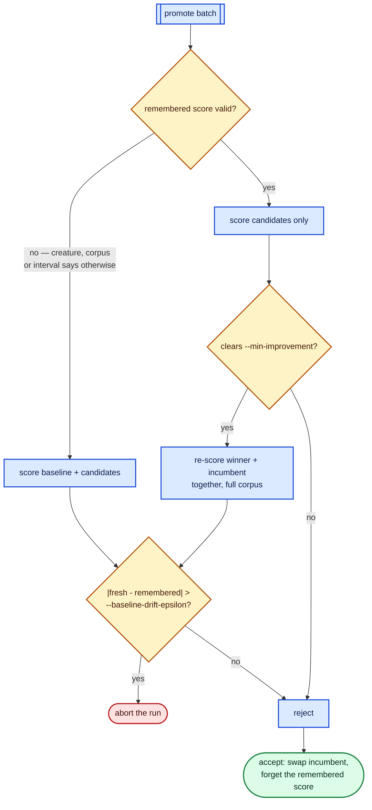

# Reusing the known full-corpus baseline (issue #113)

Issue [#113](https://github.com/stSoftwareAU/NEAT-AI-Lamarck/issues/113) — what
`--baseline-reverify-interval` removes from a promote call, what guards replace
the pairing it gives up, and what the paired benchmark measured.

**No default is changed by this issue.** `--baseline-reverify-interval` defaults
to `0`, which is byte-for-byte the pre-#113 run: every promote call carries the
incumbent.

## What is being removed

`write_candidate_batch` writes the incumbent into the screen directory and
`write_promote_batch` copied it again into the promote directory, so the
incumbent was scored **on the full corpus, from scratch, in every promote call**
— re-deriving a constant. Its full-corpus score is established by the Phase-0
parity gate at run start and re-established on every accept, and between accepts
the incumbent does not change. `docs/followup-economics.md` records 0 accepts in
118 experiments and `docs/baseline-economics.md` 2 in 75, so "between accepts" is
almost the whole run.

The size of the constant: in the #8 baseline, 115 candidates were promote-scored
across 26 non-empty screens — ≈3.4 candidates plus the baseline per call, so the
baseline is ≈23% of a promote call's creature-scores.

The screen phase is deliberately untouched. Its sample phase rotates per
experiment (`ScoreSample { rate, phase: experiments - 1 }`), so each screen
scores the incumbent on a different stratum and that sampled score is genuinely
new information.

## What replaces the pairing

A paired promote call is self-verifying: candidate and baseline are scored by
the same binary, on the same corpus, in the same process, at the same moment.
Reusing a remembered number gives that up, so three guards take its place —
each pinned by tests in `lamarck/src/run.rs` and `lamarck/src/baseline.rs`.



1. **Keyed to everything that could invalidate it.** The creature's coarse
   `incumbentId` *and* its content fingerprint — a weight-only accept leaves the
   shape id untouched, so the id alone would be a false key — plus a fingerprint
   of every `*.bin` in the training directory with its size and mtime.
   `docs/baseline-economics.md` records the corpus being deleted mid-run by GRQ
   `node.sh`, so "the data changed under the run" is history here.
2. **Every accept is verified before the swap.** A winner proposed against a
   remembered baseline is re-scored *beside the incumbent* in one full-corpus
   call, and only that fresh pair can rewrite `best.json`. A margin that exists
   only against the remembered number is withdrawn — the false accept this
   issue's risk section names as its worst outcome.
3. **Drift aborts the run.** Whenever a fresh baseline lands while a remembered
   one is held — on the interval or on the accept path — the two are compared,
   and disagreement beyond `--baseline-drift-epsilon` (default `1e-9`, three
   orders below `--min-improvement`) stops the run rather than deciding
   anything.

Each promote call journals `baselineSource` (`fresh` / `remembered` /
`rememberedVerified`), so any accept in any run is traceable, after the fact, to
the baseline that decided it.

## Paired benchmark

`lamarck/examples/promote_baseline_bench.rs` runs the real optimisation loop
twice over identical inputs — same creature, same corpus, same seed, same
wall-clock budget — with reuse off and on:

```bash
cargo run --release --example promote_baseline_bench -- 45 20000 128 24 1 3
#                                                       │  │     │   │  │ └ sweeps
#                                                       │  │     │   │  └ min improvement
#                                                       │  │     │   └ hidden neurons
#                                                       │  │     └ inputs
#                                                       │  └ corpus records
#                                                       └ seconds per arm
```

The scorer is in-process (local MSE) and **tiered like production**: a screen
call scores a 5% slice of the corpus, a promote call all of it, so the
per-creature cost is real work in both tiers and only the promote call's
composition differs between arms. `MIN_IMPROVEMENT` defaults to `1`, modelling
the accept-free stretch — the regime the saving is aimed at, because a promote
call that rejects is exactly the one that never needed the baseline re-scored.
The arms alternate and the sweep is repeated, because they run sequentially and
box load drifting between them would otherwise read as an effect they did not
cause. An earlier pair of sweeps taken while this box was busy swung the
experiment count by ±13% in **both** directions; the numbers below were taken
with nothing else running.

| Item | Value |
|------|-------|
| Host | 10-core Apple M4, 24 GiB RAM, macOS, otherwise idle |
| Creature | synthetic: 128 inputs, 24 TANH hidden, 1 output |
| Corpus | 20 000 records; screen tier 1 000 records (5%) |
| Budget | 45 s per arm, seed 7, `--candidates 8`, `--screen-sample-rate 0.05` |
| Arms | `--baseline-reverify-interval 0` vs `25`, alternated, 3 sweeps |

### Result

Measured 2026-08-12. Raw log:
[`docs/evidence/baseline-reuse/paired-sweeps.log`](evidence/baseline-reuse/paired-sweeps.log).

| Sweep | Arm | Experiments | Creature-scores/promote call | ms/promote call | ms/creature-score |
|-------|-----|-------------|------------------------------|-----------------|-------------------|
| 1 | paired | 369 | 5.86 | 29.1 | 4.96 |
| 1 | remembered | 385 | 4.91 | 24.2 | 4.92 |
| 2 | paired | 369 | 5.86 | 28.8 | 4.92 |
| 2 | remembered | 389 | 4.91 | 24.1 | 4.90 |
| 3 | paired | 371 | 5.87 | 28.8 | 4.91 |
| 3 | remembered | 387 | 4.91 | 24.2 | 4.94 |

Medians, before → after:

| Metric | Paired | Remembered | Change |
|--------|--------|------------|--------|
| Promote creature-scores per call | 5.86 | 4.91 | **-16.2%** (exactly one creature) |
| Promote-phase ms per call | 28.8 | 24.2 | **-16.0%** |
| Experiments completed in the budget | 369 | 387 | **+4.9%** |
| ms per promote creature-score | 4.92 | 4.92 | unchanged |

The last row is the check that the saving is the one claimed: the cost of
scoring *one creature* did not move, so the promote call got cheaper only by
carrying one creature fewer. Promote-ms tracks the creature count to within
0.2 percentage points, and every sweep agrees to ±0.6% on the experiment count.

### Projected onto a production run

From [`docs/scorer-call-cost.md`](scorer-call-cost.md) (issue #112), a
full-corpus promote call costs ≈1 977 ms fixed plus ≈5 490 ms per creature.
The issue #8 baseline run made 26 promote calls in 45 minutes for 2 236 s of
scorer time, so removing one creature from each is:

```text
26 × 5.49 s ≈ 143 s  ≈ 6.4% of scorer time  ≈ 5% of a 45-minute run
```

That is the lower half of the 5–10% the issue estimated, and it is the honest
number: #112 measured the promote call's fixed cost at only ≈6% of the call, so
the marginal per-creature cost dominates and one creature is worth close to its
share. The benchmark's own +4.9% on experiments completed sits in the same
place, which is the point of quoting both. The saving scales with anything that
raises promote calls per hour and shrinks as the promoted batch grows.

## What this measurement cannot support

- **A synthetic creature and corpus.** 128 inputs and 20 000 records against the
  production creature's 2 511 inputs and 2 262 277 records. The *ratio* the
  benchmark measures (one creature out of ~6 per promote call) transfers; the
  absolute milliseconds do not.
- **One host, three sweeps.** The three sweeps agree closely, but they are one
  box on one afternoon. A busy box moved the experiment count by ±13% in both
  directions, so treat the wall-clock row as valid for an idle host only.
- **The accept-free regime only.** `MIN_IMPROVEMENT 1` means no arm paid for an
  accept verification. A run that accepts often pays two extra creature-scores
  per accept, which `report`'s `baselineReuse.netCreatureScoresSaved` subtracts
  rather than hides. At the observed accept rates (0 in 118, 2 in 75) this is
  noise; at a high accept rate the saving would shrink.
- **It says nothing about the scorer's own determinism.** The drift guard exists
  precisely because that is not measured here.
