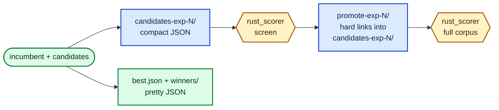

# Compact batch files and linked promote directories (issue #114)

Issue [#114](https://github.com/stSoftwareAU/NEAT-AI-Lamarck/issues/114) — what
the scorer-facing batch files cost, what dropping the pretty-printer and the
promote copies actually saved, and the honest size of that saving.

**Nothing a human reads changed.** `best.json`, `winners/` and every other
human-facing artefact are still pretty-printed; only the files whose sole reader
is `rust_scorer` are compact.

## What changed



- `write_candidate_batch` (`lamarck/src/candidates.rs`) writes `baseline.json`
  and every `candidate-NNN.json` compactly. The baseline still carries its
  `uuid` / `tags` — `serialize_creature_with_meta_compact`
  (`lamarck/src/tags.rs`) is the same document as the pretty form with the
  whitespace dropped, which the round-trip test in `lamarck/src/tags.rs` pins.
- `write_promote_batch` (`lamarck/src/scorer.rs`) hard-links the promoted files
  from the screen directory instead of copying them, and falls back to a copy
  when the link fails — a destination that already exists, a different
  filesystem (`EXDEV`), a filesystem with no hard links. A missing source still
  fails loudly; the fallback covers link failures, never a batch file that was
  never written.

Nothing mutates a batch file in place — they are written once and the directory
is deleted whole — so the shared inode is safe.

## What it measured

`lamarck/examples/batch_io_bench.rs` writes a whole production-shaped batch in
both formats, interleaved and repeated, and reports the fastest run of each arm.
Raw output: [`docs/evidence/batch-io/batch-io-bench.log`](evidence/batch-io/batch-io-bench.log).

```bash
cargo run --release --example batch_io_bench -- 29 10
```

Creature: 2511 inputs, 1591 neurons, 23 479 synapses. Batch: baseline plus 29
candidates — the size the fixed opening quotas reach on the production creature.
Host: 10-core Apple M4, APFS.

| Arm | Bytes written | Write ms | Read ms | Parse ms |
|-----|---------------|----------|---------|----------|
| pretty | 87 044 472 | 137–165 | 10.0–10.2 | 184–241 |
| compact | 61 090 302 | 111–130 | 7.1–7.3 | 177–200 |
| **delta** | **-29.8%** | **-10% to -32%** | **-28%** | **-3% to -17%** |

Promote directory, 4 files presented a second time:

| Arm | Bytes written | ms |
|-----|---------------|-----|
| copy | 8 145 386 | 0.5–0.6 |
| link | 0 | 1.4 |

## What that is worth — and what it is not

**Bytes: a real, repeatable ~30% cut.** 87.0 MB → 61.1 MB per batch, so ≈26 MB
less written and read per experiment and ≈1.9 GB over a 75-experiment run. The
promote directory drops a further 8.1 MB of copies per experiment, which is what
`--preserve-losers` disk churn is made of.

**Wall clock: far below the issue's estimate, and honestly so.** The issue
projected 1%–4% of a 36–65 s experiment. The measurement does not support that.
Serialising and writing the batch saves ≈25 ms, and the scorer's read-plus-parse
of those bytes saves ≈15 ms — together well under 0.2% of one experiment. The
pretty-printer was never the expensive part: parse time is dominated by parsing
21 k full-precision floats, which both formats do identically, and a full-corpus
scorer call is ≈11 s per creature of activation work that this change does not
touch. **Record this as a null timing result.**

**The hard link is not a time saving on this host.** APFS `fs::copy` is a
copy-on-write clone, so it is already cheaper than creating four directory
entries — the link arm measures *slower* (1.4 ms vs 0.6 ms) at this batch size.
On a filesystem where a copy is a genuine byte copy (ext4, the production Linux
box) the copy pays for 8.1 MB it no longer has to write. The link's dependable
win is the 8.1 MB, not the microseconds.

## Limits

- One host, one filesystem. APFS flatters the copy arm and every absolute
  millisecond here is macOS-specific; the byte counts are not.
- The creature is synthesised to the production shape rather than being the GRQ
  champion, which was not available on the benchmark host. Pass a creature path
  as the third argument to measure a real one.
- Timings are best-of-N. Median or mean would report the host's noise as well as
  the work, and the arms differ by less than that noise on the parse side.
