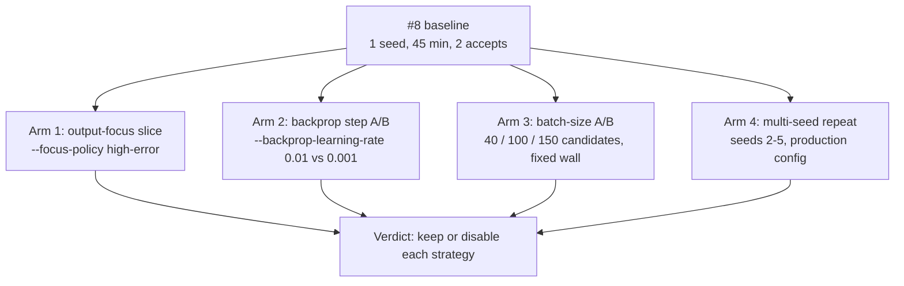

# Lamarck follow-up economics (issue #75)

The four experiments [`docs/baseline-economics.md`](baseline-economics.md)
recommended and issue [#8](https://github.com/stSoftwareAU/NEAT-AI-Lamarck/issues/8)
never ran. The #8 strategy table was a single 45-minute, single-seed sample
(75 experiments, 2 accepts, both `random`); this campaign adds the arms needed
before any strategy is judged.

Reproduce with:

```bash
cargo build --release
CREATURE=../GRQ-cluster/network.json \
SCORER=../NEAT-AI-scorer/target/release/rust_scorer \
scripts/run-followup-economics.sh                     # or one arm at a time
scripts/summarise-followup-economics.sh .lamarck-followup
```



## Environment

| Item | Value |
|------|--------|
| Host | Apple M4, 10 cores, 24 GiB, macOS 26.6 |
| Creature | `../GRQ-cluster/network.json` (2511 inputs, 1600 neurons) |
| Training | private copy of GRQ `.trainData-binary_116` (21 GiB, 2 262 277 records) under `.lamarck-followup/train-data`, per the #8 operational note |
| Scorer | `../NEAT-AI-scorer/target/release/rust_scorer` (CPU directory mode) |
| Binary | `neat_ai_lamarck` 0.1.9 (post-#83 backprop blame routing, post-#74 combo attribution) |
| Opening score | `0.346759634929` (Phase-0 parity passed in every arm) |
| Shared knobs | `--quick --quick-sample-records 25000 --screen-sample-rate 0.05` |

**Load caveat — read every per-minute figure against it.** Unlike the #8
baseline, this campaign shared the box with a live GRQ `Learn.ts` run: 1-minute
load averages of 12–18 on 10 cores throughout. Absolute throughput here is
therefore *lower* than #8's (~37–65 s/experiment against #8's ~36 s), and
arm-to-arm comparisons are only fair because every arm ran sequentially under
the same background load. Each arm records its own `loadBefore` / `loadAfter` in
`timing.txt`.

The creature has also moved on since #8 — GRQ evolution lifted the opening score
from `0.344965` to `0.346760`, so accept rates here are measured against a
harder incumbent.

## Arm 1 — Output-focus slice (#75.1)

Two slices, because the two the issue offered are not the same experiment.

| Slice | Flags | Exps | Accepts | Screen scores | Full scores | Promote/scorer-min | Analysis share |
|-------|-------|------|---------|---------------|-------------|--------------------|----------------|
| `high-error` policy | `--focus-policy high-error`, 1200 s | 35 | 0 | 1015 | 29 | 2.02 | 30% |

### `high-error` never reaches the output

All 35 experiments landed on the same **hidden** neuron
(`neuron-1062597868`): `TANH`, mean saturation **0.99992**, 105 incoming links,
mean `|blame|` 2.3e13. `mean_error_bias` did not appear once, exactly as in #8 —
so `--focus-policy high-error` **cannot** measure output-residual economics. It
ranks by error-influence mass, and the hidden blame mass on this creature is
~10 orders of magnitude above the output residual.

Worse, the neuron it sticks on is saturated to four nines: a `TANH` at
`|post| ≈ 1` has a derivative of ~0, so every proposal on it is fighting a dead
gradient. 1015 screened candidates produced 29 promotions and **zero** accepts.
That is a result about the policy, not about the output: `high-error` is a
throughput sink on a fine-tuned creature, and #8's advice to prefer `weighted`
is confirmed rather than softened.
