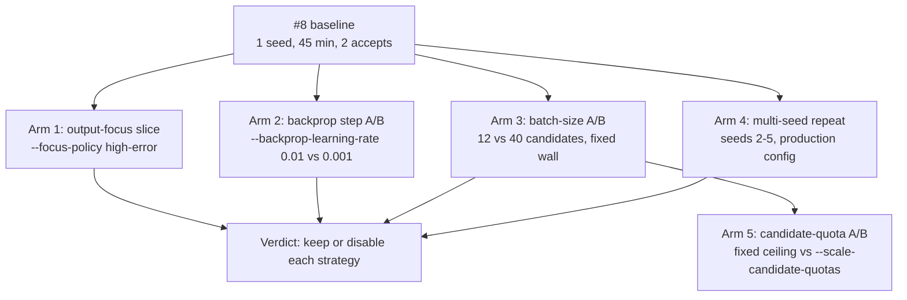

# Lamarck follow-up economics (issue #75)

The four experiments [`docs/baseline-economics.md`](baseline-economics.md)
recommended and issue [#8](https://github.com/stSoftwareAU/NEAT-AI-Lamarck/issues/8)
never ran. The #8 strategy table was a single 45-minute, single-seed sample
(75 experiments, 2 accepts, both `random`); this campaign adds the arms needed
before any strategy is judged.

**Two #75-era campaigns exist — do not equate them (Issue #132).** This write-up
is the **scripted #75 campaign**: seeds **11 / 21 / 31**, journals under
`.lamarck-followup`, arms named `high-error`, `backprop-step-0.01` /
`0.001`, `batch-size-12` / `40`. A separate **local calibration campaign**
(`~/.lamarck-followup-75`, mostly seed **1**, Lamarck `0.1.7`) produced the
journals mined by
[`docs/screen-calibration.md`](screen-calibration.md) and
[`docs/promote-gate.md`](promote-gate.md) — including an `output-focus`
(`--focus-neuron output-0`), `backprop-cap-tenth` and `seed-2` arm. Those
files are **not** the journals behind this document; they shared a box, report
no strategy economics, and do not close [#75](https://github.com/stSoftwareAU/NEAT-AI-Lamarck/issues/75)
or [#98](https://github.com/stSoftwareAU/NEAT-AI-Lamarck/issues/98).

Reproduce with:

```bash
cargo build --release
CREATURE=../GRQ-cluster/network.json \
SCORER=../NEAT-AI-scorer/target/release/rust_scorer \
scripts/run-followup-economics.sh                     # or one arm at a time
scripts/summarise-followup-economics.sh .lamarck-followup
```



## Environment

| Item | Value |
|------|--------|
| Host | Apple M4, 10 cores, 24 GiB, macOS 26.6 |
| Creature | `../GRQ-cluster/network.json` (2511 inputs, 1600 neurons) |
| Training | private copy of GRQ `.trainData-binary_116` (21 GiB, 2 262 277 records) under `.lamarck-followup/train-data`, per the #8 operational note |
| Scorer | `../NEAT-AI-scorer/target/release/rust_scorer` (CPU directory mode) |
| Binary | `neat_ai_lamarck` release build from this branch (post-#83 backprop blame routing, post-#74 combo attribution) |
| Opening score | `0.346759634929` (Phase-0 parity passed in every arm) |
| Shared knobs | `--quick --quick-sample-records 25000 --screen-sample-rate 0.05` |

**Load caveat — read every per-minute figure against it.** Unlike the #8
baseline, this campaign shared the box with a live GRQ `Learn.ts` run: 1-minute
load averages of 12–18 on 10 cores throughout. Absolute throughput here is
therefore *lower* than #8's (~37–65 s/experiment against #8's ~36 s), and
arm-to-arm comparisons are only fair because every arm ran sequentially under
the same background load. Each arm records its own `loadBefore` / `loadAfter` in
`timing.txt`.

The creature has also moved on since #8 — GRQ evolution lifted the opening score
from `0.344965` to `0.346760`, so accept rates here are measured against a
harder incumbent.

**Scorer caveat (#130) — every full-corpus Δ below is provisional.** This
campaign ran on a scorer whose directory score depended on *which other
creatures shared the call*: a `6.7e-8` deterministic artefact that moved the
incumbent and the candidate by different amounts, documented with the measured
numbers in
[`docs/scorer-batch-composition.md`](scorer-batch-composition.md). The
full-corpus deltas reported here sit at `1e-7`–`1e-6`, so the artefact is a
significant fraction of the very signal the `1e-6` accept bar is read off. It is
big enough to have decided the campaign's verdict: `stats_weight`'s best Δ,
`+9.76e-7`, missed the bar by `2.4e-8` — about a third of the artefact — so
"0 accepts across five arms" is not a safe conclusion. The upstream fix is
written and pushed but not yet merged or released. Re-measuring these deltas
against the released scorer is tracked in
[#143](https://github.com/stSoftwareAU/NEAT-AI-Lamarck/issues/143); until then,
read the per-strategy ordering as indicative and the Δ magnitudes as good to
about `1e-7`, not to their last digit.

## Arm 1 — Output-focus slice (#75.1)

Item #75.1 offered two ways in — `--focus-policy high-error` or
`--focus-neuron output-0`. The policy slice ran; it is reported below, and it
turned out to answer a different question than the issue expected.

| Slice | Flags | Exps | Accepts | Screen scores | Full scores | Promote/scorer-min | Analysis share |
|-------|-------|------|---------|---------------|-------------|--------------------|----------------|
| `high-error` policy | `--focus-policy high-error`, 1200 s | 35 | 0 | 1015 | 29 | 2.02 | 30% |

### `high-error` never reaches the output

All 35 experiments landed on the same **hidden** neuron
(`neuron-1062597868`): `TANH`, mean saturation **0.99992**, 105 incoming links,
mean `|blame|` 2.3e13. `mean_error_bias` did not appear once, exactly as in #8 —
so `--focus-policy high-error` **cannot** measure output-residual economics. It
ranks by error-influence mass, and the hidden blame mass on this creature is
~10 orders of magnitude above the output residual.

Worse, the neuron it sticks on is saturated to four nines: a `TANH` at
`|post| ≈ 1` has a derivative of ~0, so every proposal on it is fighting a dead
gradient. 1015 screened candidates produced 29 promotions and **zero** accepts.
That is a result about the policy, not about the output: `high-error` is a
throughput sink on a fine-tuned creature, and #8's advice to prefer `weighted`
is confirmed rather than softened.

**The `--focus-neuron output-0` slice was not run in this scripted campaign**
(see [Coverage and what is still unrun](#coverage-and-what-is-still-unrun)).
The local calibration campaign did run an `output-focus` arm (20 experiments,
seed 1) and
[`docs/screen-calibration.md`](screen-calibration.md) tabulates it — but that
run shared the box, was mined only for screen/promote pairing, and reports no
per-strategy economics, so it does not close #75.1 or measure
`mean_error_bias` here. Across the 118 scripted experiments,
`mean_error_bias` appeared **zero** times (once in the whole #8 baseline).

## Arm 2 — Backprop step A/B (#75.2)

`--backprop-learning-rate` was added for this arm (it did not exist before) and
is recorded in the journal `runHeader` so an arm is identifiable from its
journal alone. Both arms used seed 21 and `--focus-policy weighted`, so the
focus stream and candidate slots match and only the rate moves.

| Arm | Rate | Exps | Accepts | Screen scores | Full scores | Promote/scorer-min | Analysis share | Wall (s) |
|-----|------|------|---------|---------------|-------------|--------------------|----------------|----------|
| `backprop-step-0.01` | 0.01 (default) | 21 | 0 | 609 | 32 | 2.89 | 26.9% | 866 |
| `backprop-step-0.001` | 0.001 | 21 | 0 | 609 | 32 | 2.68 | 22.7% | 893 |

### The learning rate cannot move the bias step

The two arms produced **the same bias candidate, to the last digit**:

```text
0.01 : backprop bias -72.80059896570346 -> -82.80059896570346 (count=6)
0.001: backprop bias -72.80059896570346 -> -82.80059896570346 (count=6)
```

A 10x smaller rate changed nothing because the step is not rate-bound, it is
**cap**-bound: the focus carried mean `|blame|` ≈ 2.3e13, so the proposal
saturates `BackpropConfig::maximum_bias_adjustment_scale` (10.0) at either rate.
`--backprop-learning-rate` is therefore the wrong knob for this creature; the
other suggestion in #75.2 — the *cap* — is the one that binds. The behaviour is
pinned by
`candidates::tests::a_saturating_blame_mass_pins_the_bias_step_to_the_cap_whatever_the_rate`.

The weight branch does respond, because it is clamped at a much smaller
`MAX_BACKPROP_WEIGHT_DELTA` (0.01):

```text
0.01 : backprop weight neuron-1248814588 -13.117442050830672 -> -13.107442050830672  (Δ +1.0e-2, capped)
0.001: backprop weight neuron-1248814588 -13.117442050830672 -> -13.111324556813376  (Δ +6.1e-3, rate-bound)
```

So the honest reading of the A/B is: at 0.01 **both** branches sit on their
caps; at 0.001 only the weight branch moves, and it moved to no effect. A ±10
bias step against a score that accepts at `1e-6` is roughly seven orders of
magnitude too coarse — `backprop` is not failing for want of a smaller learning
rate, it is failing because a saturating blame mass sends every proposal to the
cap.

### How close each strategy came (both arms, identical)

Screen Δ is on the 5% sample; full Δ is the authoritative full-corpus number,
and `--min-improvement` is `1e-6`.

| Strategy | Candidates | Best screen Δ | Promoted | Best full-corpus Δ |
|----------|------------|---------------|----------|--------------------|
| `stats_weight` | 63 | 3.04e-5 | 6 | **+8.39e-7** |
| `structural_add` | 168 | 8.99e-6 | 11 | **+3.90e-7** |
| `structural_add_neuron` | 126 | 1.63e-6 | 1 | -2.21e-7 |
| `backprop` | 63 | 3.97e-6 | 7 | -6.66e-7 |
| `stats_bias` | 63 | 8.55e-6 | 6 | -2.18e-5 |
| `random` | 63 | 9.95e-6 | 1 | -1.06e-4 |
| `structural_weaken` | 63 | 4.19e-9 | 0 | not promoted |

Two strategies cleared zero on the full corpus and missed the `1e-6` bar by
about a factor of two — `stats_weight` and `structural_add`. That is the
opposite ordering to #8, where `random` took both accepts, and it is the
clearest single reason not to deprioritise any strategy on one sample.

It also shows the 5% screen is a weak proxy at this scale: `random` had the
second-best screen Δ in the batch and the **worst** full-corpus Δ (-1.06e-4).

## Arm 3 — Batch-size A/B (#75.3)

The arm as specified — 40 vs 100 vs 150 candidates under a fixed 15 minutes —
**cannot be run**, because all three budgets buy the same batch.

### `--candidates` above ~29 is inert

> **Superseded (#108).** Scaled quotas are now the default: every run fills
> the budget until the generator is genuinely exhausted, and
> `--fixed-candidate-quotas` reproduces the fixed ceiling below only for A/B
> benchmarking. The paired benchmark under
> [Arm 5](#arm-5--candidate-quota-scaling-108) is still worth running, but it
> gates nothing — the default was flipped by owner decision (2026-08-14).
>
> **Ceiling restated (#119).** The default path now rejects duplicate
> proposals and passes the freed slot to the next strategy, so the round-robin
> fill contributes up to three *accepted* candidates per strategy rather than
> three attempts. The ceiling measured below therefore reads ~6 higher (27 →
> 33 on the synthetic creature), and every candidate under it is a distinct
> hypothesis.

`generate_candidates` fills a batch through fixed per-phase quotas (one scaled
`structural_add` per ranked source, at most three growth squashes, two hidden
squashes, four scaled adds, then a round-robin fill of at most `8 x 3` further
attempts). Once the budget exceeds what those quotas can produce, raising it
adds nothing. On this creature the ceiling is **29**:

```text
--candidates 40  → ✓ generated 29 candidates
--candidates 100 → ✓ generated 29 candidates   (arms 1 and 2, every experiment)
--candidates 12  → ✓ generated 12 candidates   (the budget binds)
```

So 40, 100 and 150 are the same experiment run three times. `12` was
substituted as the point that actually binds, against `40` at the ceiling —
same seed 31, same `weighted` policy, same 900 s budget, run back to back.
The ceiling is pinned by
`candidates::tests::raising_the_candidate_budget_above_the_generator_ceiling_adds_nothing`.

| Arm | `--candidates` | Generated/exp | Exps | Accepts | Screen scores | Full scores | Promote/scorer-min | Screen/screen-min | Analysis share | Wall (s) |
|-----|----------------|---------------|------|---------|---------------|-------------|--------------------|-------------------|----------------|----------|
| `batch-size-12` | 12 | 12 | 24 | 0 | 288 | 16 | 1.77 | 33.6 | 39.9% | 874 |
| `batch-size-40` | 40 | **29** (ceiling) | 17 | 0 | 493 | 33 | **2.83** | **45.0** | 28.3% | 939 |

### Bigger batches win on every economic metric

The 40-candidate arm ran **fewer** experiments (17 vs 24) and still promoted
**twice** as many candidates to the full corpus (33 vs 16), because the costs
that dominate an experiment are per-*experiment*, not per-*candidate*:

- the learning-signal pass (`propagate_topological_loop`, ~11 s) runs once per
  experiment whatever the batch size, so a smaller batch amortises it over
  fewer proposals — analysis share rises from 28.3% to **39.9%**;
- the screen is a single scorer directory call, so its fixed overhead is spread
  over 13 creatures at `12` and 30 at `40` — screen throughput rises from 33.6
  to 45.0 candidates per screen-minute.

Net: 1.6x the promote-scores per scorer-minute at the ceiling. Neither arm
accepted, so this is an efficiency result, not a hit-rate one.

**No default is changed.** `--candidates 100` stays: it is already at the
ceiling, costs nothing above it, and leaves headroom if candidate generation
ever produces more. Lowering it would be strictly worse. Raising it is
pointless until the generator's quotas change — which is the more useful thing
this arm found.

## Arm 4 — Multi-seed repeat (#75.4)

**Not run in this scripted campaign.** The local calibration campaign includes a
single `seed-2` journal (26 experiments, production config) — useful for
screen-calibration pairing, not a four-seed exclusive-box repeat — so #75.4 and
[#98](https://github.com/stSoftwareAU/NEAT-AI-Lamarck/issues/98) stay open.
Four production-budget seeds is 4 × 45 minutes of exclusive box time — longer
than the whole campaign above — and it cannot be interleaved with the other
arms without contending for the scorer and invalidating every per-minute
figure. The exact command to run:

```bash
SEEDS="2 3 4 5" scripts/run-followup-economics.sh multi-seed
```

What the arms that *did* run already say about it: across 118 experiments on
three seeds (11, 21, 31) and two focus policies, **no arm reproduced #8's
accepts**, and the strategies that came closest were `stats_weight` and
`structural_add` rather than #8's `random`. The single-sample strategy ordering
in `docs/baseline-economics.md` is therefore not stable, which is exactly why no
strategy is disabled below.

## Arm 5 — Candidate-quota scaling (#108)

**Not run.** Arm 3's conclusion — that raising `--candidates` is pointless
until the generator's quotas change — is now actionable: `--scale-candidate-quotas`
scales the per-phase quotas with the budget, so the batch keeps filling until
every ranked source and squash has been proposed. What that buys in *economic*
terms is unmeasured, because the arm needs the production creature, exclusive
use of the scorer and the 21 GiB corpus.

The generator itself is measured, on a production-shaped synthetic creature
(2511 inputs, 12 hiddens, one output — the #8 creature's shape) by
`cargo run --release --example candidate_quota_bench`:

| `--candidates` | Fixed quotas | Distinct | Scaled quotas | Distinct | Generation (scaled) |
|----------------|--------------|----------|---------------|----------|---------------------|
| 12 | 12 (budget) | 12 | 12 (budget) | 12 | 1.5 ms |
| 29 | 29 (budget) | 29 | 29 (budget) | 29 | 5.2 ms |
| 40 | 33 (ceiling) | 33 | 40 (budget) | 40 | 7.1 ms |
| 60 | 33 (ceiling) | 33 | 60 (budget) | 60 | 9.1 ms |
| 100 | 33 (ceiling) | 33 | 100 (budget) | 100 | 12.1 ms |
| 120 | 33 (ceiling) | 33 | 120 (budget) | 120 | 13.9 ms |
| 240 | 33 (ceiling) | 33 | 240 (budget) | 240 | 25.7 ms |

Two things to read off it. Generation costs ~0.1 ms per candidate — four
orders of magnitude below the ~11 s per-experiment learning pass, so the extra
batch costs **screen time**, not generation time, and that is exactly what the
paired arm has to price. And both paths now propose only distinct hypotheses:
a batch of *N* is *N* mutations, not *N* slots.

Before issue #119 the fixed-quota column read `27 (ceiling) | 22` at every
budget from 29 up: five of the 27 creatures screened each experiment were
byte-identical hypotheses differing only in a grown neuron's random UUID, so
they were screened — and sometimes promoted — twice. The rejection the scaled
path already applied now runs on the default path too, and the rejected
proposal's slot falls through to the next strategy instead of shrinking the
batch:

| `--candidates` | Before (#119) | Distinct | After | Distinct |
|----------------|---------------|----------|-------|----------|
| 12 | 12 (budget) | 11 | 12 (budget) | 12 |
| 29 | 27 (ceiling) | 22 | **29 (budget)** | **29** |
| 40–240 | 27 (ceiling) | 22 | 33 (ceiling) | 33 |

At the production `--candidates 29` that trades **+2 screened creatures for +7
distinct hypotheses**. Priced with the screen fit in
[`docs/scorer-call-cost.md`](scorer-call-cost.md) (9 898 ms fixed + 452 ms per
creature), the screen call goes 22.1 s → 23.0 s while the cost per *distinct*
hypothesis falls **1.00 s → 0.79 s (-21%)**. Generation itself rises 3.2 ms →
5.2 ms per experiment — the fingerprint hash over a 23 479-synapse creature —
which is under 0.02% of a 36–65 s experiment.

Strategy mix at `--candidates 120` on that creature, fixed → scaled:

| Strategy | Fixed | Scaled |
|----------|-------|--------|
| `structural_add` | 11 | 49 |
| `structural_add_neuron` | 3 | 28 |
| `stats_weight` | 6 | 14 |
| `stats_bias` | 6 | 14 |
| `random` | 5 | 13 |
| `structural_weaken` | 1 | 1 |
| `mean_error_bias` | 1 | 1 |

No family disappears. Two shifts are expected and recorded: the mix tilts
towards the structural families, whose hypothesis space (ranked sources ×
weight scales, ranked sources × squashes) is what the extra budget sweeps; and
`structural_weaken` and `structural_add_neuron` hold at 1 and 3 because their
repeat proposals at a spent grid position are duplicates, dropped on both paths
since #119 rather than counted. (`backprop` appears in neither column: the
benchmark supplies no learning signal, so it proposes nothing on either side —
see Arm 2 for its own economics.)

Run the paired benchmark with:

```bash
QUOTA_SECONDS=900 QUOTA_CANDIDATES=100 \
  scripts/run-followup-economics.sh candidate-quotas
```

Both sides share seed 61, the wall budget and `--candidates`; only the flag
moves. Report experiments, screen scores, full-corpus promotions,
promote-scores per scorer-minute and score improvement per wall-clock hour. The
default only changes if the scaled side wins on **promote rate and
accepts-per-hour**, not on batch size.

## Arm 6 — Multi-focus experiments (#109)

**Not run on the production creature.** Like Arm 5 it needs exclusive use of
the scorer and the 21 GiB corpus. The loop itself is measured, on the same
synthetic shape the memo arm used (128 inputs, 24 TANH hiddens, one output;
20 000 records; 60 s wall budget; seed 7; accept-free `min_improvement 1`), by
`cargo run --release --example focus_fanout_bench`. Best of three interleaved
repeats:

| `--focus-count` | `--candidates` | Experiments | Candidates | Candidates/analysis-min | Promote scores/scorer-min |
|---|---|---|---|---|---|
| 1 | 12 | 380 | 4560 | 8955 | 9844 |
| 3 | 12 | 324 | 3888 | 7507 | 8537 |
| 3 | 36 | 180 | 6480 | **23 194** | 9392 |

Two things to read off it. Holding the *total* batch at 12 makes K = 3 slightly
**worse** on throughput (0.84×): the batch size did not move, but the experiment
now pays three focus scans instead of one. The amortisation only pays when each
focus keeps its own share of the budget — at 12 candidates *per focus* the same
shared learning pass produces **2.6× the candidates per analysis-minute**, which
is inside the 1.5×–3× the issue estimated, while the promote rate holds at 0.95×
(9392 vs 9844), so the batch is not spread so thin that the structural quotas
stop firing.

In an accept-rich regime (`min_improvement 1e-6`, 45 s, best of two) the
throughput result repeats (17 591 vs 5699 candidates/analysis-min, 3.1×) but
K = 1 still won on improvement per wall-clock hour (1.73e-1 vs 1.64e-1): more
focuses means each accept is followed by a memo invalidation covering work spent
on focuses that did not win. That is the question the production arm has to
settle, so `--focus-count` ships **opt-in at 1**, exactly as
`--scale-candidate-quotas` did.

Run the paired benchmark with:

```bash
FOCUS_COUNT_SECONDS=900 FOCUS_COUNT_CANDIDATES=40 \
  scripts/run-followup-economics.sh focus-count
```

Both sides share seed 71, the wall budget and the per-focus candidate share
(the K = 3 side asks for 3× the budget, because `--candidates` is split between
the focuses); only `--focus-count` moves. The default only changes if the
multi-focus side wins on **accepts-per-hour**, not on candidates per minute.

## Verdict — what to disable

**Nothing is disabled.** Every strategy stays enabled. Across all five arms —
118 experiments, 3014 candidates, 162 full-corpus promotions, **0 accepts**:

> Read this table against the [scorer caveat (#130)](#environment) above: the
> `6.7e-8` batch-composition artefact is larger than the `2.4e-8` by which the
> best Δ here missed the accept bar, so the "0 accepts" headline and the
> ordering below are both provisional until #143 re-measures them.

| Strategy | Candidates | Promoted | Best full-corpus Δ | Verdict |
|----------|------------|----------|--------------------|---------|
| `stats_weight` | 306 | 19 | **+9.76e-7** | **Keep** — missed the `1e-6` accept bar by 2.4%; the closest any strategy came |
| `structural_add` | 896 | 47 | **+5.28e-7** | **Keep** — second closest, and the most-tried strategy |
| `structural_add_neuron` | 660 | 2 | -2.21e-7 | **Keep** — rarely survives the screen, but it is the only strategy that grows the creature |
| `backprop` | 306 | 41 | -3.68e-7 | **Keep, but re-tune** — the failure is the ±10 step cap, not the strategy; the A/B must vary `maximum_bias_adjustment_scale`, not the learning rate |
| `stats_bias` | 282 | 30 | -1.93e-5 | **Keep** — consistently negative here, but on one focus family only |
| `random` | 282 | 3 | -6.76e-5 | **Keep** — worst full-corpus Δ of the campaign, yet it took **both** of #8's accepts; the two samples disagree, so neither is decisive |
| `structural_weaken` | 282 | 0 | never promoted | **Keep** — costs a batch slot, never a full-corpus scorer call; the cheapest strategy to leave enabled |
| `mean_error_bias` | **0** | — | — | **Unmeasured** — needs an output focus, which no arm reached; cannot be judged |
| `stats_skew_bias` | **0** | — | — | **Unmeasured** — same reason: it proposes from the output target's skew, so it needs the same slice |

The campaign supports one operational recommendation, and it is about a flag
rather than a strategy: **do not run `--focus-policy high-error` on a
fine-tuned creature.** It pinned all 35 experiments on a `TANH` saturated to
0.99992 and returned zero accepts from 1015 screened candidates. `weighted`
stays the default; nothing about it is changed here.

## Coverage and what is still unrun

Status below is for **this scripted #75 campaign** only. The local calibration
campaign (`~/.lamarck-followup-75`) already has journals named `output-focus`,
`backprop-cap-tenth` and `seed-2` — see
[`docs/screen-calibration.md`](screen-calibration.md) — but they do not close
these rows: shared-box load, strategy economics unreported, and not the
exclusive-box protocol #98 requires.

| #75 item | Status (scripted campaign) |
|----------|--------|
| 1. Output-focus slice | **Partly run** — `high-error` policy done (35 experiments); `--focus-neuron output-0` **unrun here** (a local calibration `output-focus` journal exists but does not measure strategy economics), so `mean_error_bias` / `stats_skew_bias` stay unmeasured for this write-up |
| 2. Backprop step A/B | **Run** — and it showed the learning rate is the wrong knob; the cap A/B is **unrun here** (local calibration has `backprop-cap-tenth`, mined for screen pairing only) |
| 3. Batch-size A/B | **Run** — see the ceiling result above |
| 4. Multi-seed repeat | **Unrun here** — 3 hours of exclusive box time (local calibration has one `seed-2` journal, not seeds 2–5) |
| #108. Candidate-quota scaling | **Unrun** — the generator change has landed behind `--scale-candidate-quotas`; the paired economics arm needs the same exclusive box time |
| #109. Multi-focus experiments | **Unrun** — the loop change has landed behind `--focus-count`; the paired economics arm needs the same exclusive box time |

The remaining work is one follow-up, not three: it is all "arms that need
exclusive box time on the production creature". [#96](https://github.com/stSoftwareAU/NEAT-AI-Lamarck/issues/96)
wired the arms up; running them is tracked in
[#98](https://github.com/stSoftwareAU/NEAT-AI-Lamarck/issues/98).

### The three outstanding arms are now wired up (#96)

All three are arms of `scripts/run-followup-economics.sh` and none of them is in
the default arm set: each needs the production creature and **exclusive** use of
the scorer, so a second Lamarck or GRQ run beside them corrupts every per-minute
figure they exist to produce. Run them one at a time, on an otherwise idle box:

| Arm | Command | Budget | What it measures |
|-----|---------|--------|------------------|
| Multi-seed repeat | `SEEDS="2 3 4 5" scripts/run-followup-economics.sh multi-seed` | 4 × 45 min | Whether the strategy ordering is stable across seeds — the gate on deprioritising any strategy |
| Output slice | `scripts/run-followup-economics.sh output-neuron` | ~20 min | `mean_error_bias` / `stats_skew_bias`, which have **zero** appearances in 118 experiments because no arm reached an output focus |
| Backprop cap A/B | `scripts/run-followup-economics.sh backprop-cap` | ~20 min | Whether a bias step sized near the `1e-6` accept bar is worth anything, now that the ±10 default is known to be cap-bound |
| Candidate-quota A/B (#108) | `scripts/run-followup-economics.sh candidate-quotas` | 2 × 15 min | Whether a budget-filling batch beats the fixed ceiling on promote rate and accepts-per-hour — the gate on making `--scale-candidate-quotas` the default |

Two enablers were added for them:

- The output slice pins the focus (`--focus-neuron output-0`, overridable with
  `OUTPUT_NEURON`) rather than asking a policy to reach the output. Arm 1 above
  showed `--focus-policy high-error` cannot get there on this creature; a pinned
  UUID that does not exist aborts the run rather than falling back to policy
  selection, so a mis-named neuron costs seconds instead of a whole slot.
- The cap A/B needed a knob that did not exist. `--backprop-max-bias-adjustment-scale`
  overrides `BackpropConfig::maximum_bias_adjustment_scale`, mirroring
  `--backprop-learning-rate`, and is recorded in the journal `runHeader` so an
  arm is identifiable from its journal alone. The ladder defaults to
  `10 0.01 0.000001` (`BACKPROP_CAPS`), walking the step down the seven orders
  of magnitude that separate the default cap from the accept bar. That the cap —
  unlike the rate — actually resizes a blame-saturated step is pinned by
  `candidates::tests::lowering_the_bias_cap_resizes_the_saturated_backprop_step`.

Until those arms run, the verdict table above stands as written: nothing is
disabled, and the two strategies that need an output focus stay unmeasured.

Per [#74](https://github.com/stSoftwareAU/NEAT-AI-Lamarck/issues/74), combo wins
are attributed to every member strategy in these journals, so unlike the #8
baseline the tables above have no `comboAcceptancesUnattributed` skew — the
count is 0 in every arm because there were no accepts to attribute.
