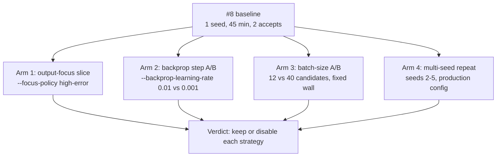

# Lamarck follow-up economics (issue #75)

The four experiments [`docs/baseline-economics.md`](baseline-economics.md)
recommended and issue [#8](https://github.com/stSoftwareAU/NEAT-AI-Lamarck/issues/8)
never ran. The #8 strategy table was a single 45-minute, single-seed sample
(75 experiments, 2 accepts, both `random`); this campaign adds the arms needed
before any strategy is judged.

Reproduce with:

```bash
cargo build --release
CREATURE=../GRQ-cluster/network.json \
SCORER=../NEAT-AI-scorer/target/release/rust_scorer \
scripts/run-followup-economics.sh                     # or one arm at a time
scripts/summarise-followup-economics.sh .lamarck-followup
```



## Environment

| Item | Value |
|------|--------|
| Host | Apple M4, 10 cores, 24 GiB, macOS 26.6 |
| Creature | `../GRQ-cluster/network.json` (2511 inputs, 1600 neurons) |
| Training | private copy of GRQ `.trainData-binary_116` (21 GiB, 2 262 277 records) under `.lamarck-followup/train-data`, per the #8 operational note |
| Scorer | `../NEAT-AI-scorer/target/release/rust_scorer` (CPU directory mode) |
| Binary | `neat_ai_lamarck` release build from this branch (post-#83 backprop blame routing, post-#74 combo attribution) |
| Opening score | `0.346759634929` (Phase-0 parity passed in every arm) |
| Shared knobs | `--quick --quick-sample-records 25000 --screen-sample-rate 0.05` |

**Load caveat — read every per-minute figure against it.** Unlike the #8
baseline, this campaign shared the box with a live GRQ `Learn.ts` run: 1-minute
load averages of 12–18 on 10 cores throughout. Absolute throughput here is
therefore *lower* than #8's (~37–65 s/experiment against #8's ~36 s), and
arm-to-arm comparisons are only fair because every arm ran sequentially under
the same background load. Each arm records its own `loadBefore` / `loadAfter` in
`timing.txt`.

The creature has also moved on since #8 — GRQ evolution lifted the opening score
from `0.344965` to `0.346760`, so accept rates here are measured against a
harder incumbent.

## Arm 1 — Output-focus slice (#75.1)

Item #75.1 offered two ways in — `--focus-policy high-error` or
`--focus-neuron output-0`. The policy slice ran; it is reported below, and it
turned out to answer a different question than the issue expected.

| Slice | Flags | Exps | Accepts | Screen scores | Full scores | Promote/scorer-min | Analysis share |
|-------|-------|------|---------|---------------|-------------|--------------------|----------------|
| `high-error` policy | `--focus-policy high-error`, 1200 s | 35 | 0 | 1015 | 29 | 2.02 | 30% |

### `high-error` never reaches the output

All 35 experiments landed on the same **hidden** neuron
(`neuron-1062597868`): `TANH`, mean saturation **0.99992**, 105 incoming links,
mean `|blame|` 2.3e13. `mean_error_bias` did not appear once, exactly as in #8 —
so `--focus-policy high-error` **cannot** measure output-residual economics. It
ranks by error-influence mass, and the hidden blame mass on this creature is
~10 orders of magnitude above the output residual.

Worse, the neuron it sticks on is saturated to four nines: a `TANH` at
`|post| ≈ 1` has a derivative of ~0, so every proposal on it is fighting a dead
gradient. 1015 screened candidates produced 29 promotions and **zero** accepts.
That is a result about the policy, not about the output: `high-error` is a
throughput sink on a fine-tuned creature, and #8's advice to prefer `weighted`
is confirmed rather than softened.

**The `--focus-neuron output-0` slice was not run** (see
[Coverage and what is still unrun](#coverage-and-what-is-still-unrun)), so
`mean_error_bias` remains unmeasured: it appeared once in the whole #8 baseline
and **zero** times across all 118 experiments here.

## Arm 2 — Backprop step A/B (#75.2)

`--backprop-learning-rate` was added for this arm (it did not exist before) and
is recorded in the journal `runHeader` so an arm is identifiable from its
journal alone. Both arms used seed 21 and `--focus-policy weighted`, so the
focus stream and candidate slots match and only the rate moves.

| Arm | Rate | Exps | Accepts | Screen scores | Full scores | Promote/scorer-min | Analysis share | Wall (s) |
|-----|------|------|---------|---------------|-------------|--------------------|----------------|----------|
| `backprop-step-0.01` | 0.01 (default) | 21 | 0 | 609 | 32 | 2.89 | 26.9% | 866 |
| `backprop-step-0.001` | 0.001 | 21 | 0 | 609 | 32 | 2.68 | 22.7% | 893 |

### The learning rate cannot move the bias step

The two arms produced **the same bias candidate, to the last digit**:

```text
0.01 : backprop bias -72.80059896570346 -> -82.80059896570346 (count=6)
0.001: backprop bias -72.80059896570346 -> -82.80059896570346 (count=6)
```

A 10x smaller rate changed nothing because the step is not rate-bound, it is
**cap**-bound: the focus carried mean `|blame|` ≈ 2.3e13, so the proposal
saturates `BackpropConfig::maximum_bias_adjustment_scale` (10.0) at either rate.
`--backprop-learning-rate` is therefore the wrong knob for this creature; the
other suggestion in #75.2 — the *cap* — is the one that binds. The behaviour is
pinned by
`candidates::tests::a_saturating_blame_mass_pins_the_bias_step_to_the_cap_whatever_the_rate`.

The weight branch does respond, because it is clamped at a much smaller
`MAX_BACKPROP_WEIGHT_DELTA` (0.01):

```text
0.01 : backprop weight neuron-1248814588 -13.117442050830672 -> -13.107442050830672  (Δ +1.0e-2, capped)
0.001: backprop weight neuron-1248814588 -13.117442050830672 -> -13.111324556813376  (Δ +6.1e-3, rate-bound)
```

So the honest reading of the A/B is: at 0.01 **both** branches sit on their
caps; at 0.001 only the weight branch moves, and it moved to no effect. A ±10
bias step against a score that accepts at `1e-6` is roughly seven orders of
magnitude too coarse — `backprop` is not failing for want of a smaller learning
rate, it is failing because a saturating blame mass sends every proposal to the
cap.

### How close each strategy came (both arms, identical)

Screen Δ is on the 5% sample; full Δ is the authoritative full-corpus number,
and `--min-improvement` is `1e-6`.

| Strategy | Candidates | Best screen Δ | Promoted | Best full-corpus Δ |
|----------|------------|---------------|----------|--------------------|
| `stats_weight` | 63 | 3.04e-5 | 6 | **+8.39e-7** |
| `structural_add` | 168 | 8.99e-6 | 11 | **+3.90e-7** |
| `structural_add_neuron` | 126 | 1.63e-6 | 1 | -2.21e-7 |
| `backprop` | 63 | 3.97e-6 | 7 | -6.66e-7 |
| `stats_bias` | 63 | 8.55e-6 | 6 | -2.18e-5 |
| `random` | 63 | 9.95e-6 | 1 | -1.06e-4 |
| `structural_weaken` | 63 | 4.19e-9 | 0 | not promoted |

Two strategies cleared zero on the full corpus and missed the `1e-6` bar by
about a factor of two — `stats_weight` and `structural_add`. That is the
opposite ordering to #8, where `random` took both accepts, and it is the
clearest single reason not to deprioritise any strategy on one sample.

It also shows the 5% screen is a weak proxy at this scale: `random` had the
second-best screen Δ in the batch and the **worst** full-corpus Δ (-1.06e-4).

## Arm 3 — Batch-size A/B (#75.3)

The arm as specified — 40 vs 100 vs 150 candidates under a fixed 15 minutes —
**cannot be run**, because all three budgets buy the same batch.

### `--candidates` above ~29 is inert

`generate_candidates` fills a batch through fixed per-phase quotas (one scaled
`structural_add` per ranked source, at most three growth squashes, two hidden
squashes, four scaled adds, then a round-robin fill of at most `8 x 3` further
attempts). Once the budget exceeds what those quotas can produce, raising it
adds nothing. On this creature the ceiling is **29**:

```text
--candidates 40  → ✓ generated 29 candidates
--candidates 100 → ✓ generated 29 candidates   (arms 1 and 2, every experiment)
--candidates 12  → ✓ generated 12 candidates   (the budget binds)
```

So 40, 100 and 150 are the same experiment run three times. `12` was
substituted as the point that actually binds, against `40` at the ceiling —
same seed 31, same `weighted` policy, same 900 s budget, run back to back.
The ceiling is pinned by
`candidates::tests::raising_the_candidate_budget_above_the_generator_ceiling_adds_nothing`.

| Arm | `--candidates` | Generated/exp | Exps | Accepts | Screen scores | Full scores | Promote/scorer-min | Screen/screen-min | Analysis share | Wall (s) |
|-----|----------------|---------------|------|---------|---------------|-------------|--------------------|-------------------|----------------|----------|
| `batch-size-12` | 12 | 12 | 24 | 0 | 288 | 16 | 1.77 | 33.6 | 39.9% | 874 |
| `batch-size-40` | 40 | **29** (ceiling) | 17 | 0 | 493 | 33 | **2.83** | **45.0** | 28.3% | 939 |

### Bigger batches win on every economic metric

The 40-candidate arm ran **fewer** experiments (17 vs 24) and still promoted
**twice** as many candidates to the full corpus (33 vs 16), because the costs
that dominate an experiment are per-*experiment*, not per-*candidate*:

- the learning-signal pass (`propagate_topological_loop`, ~11 s) runs once per
  experiment whatever the batch size, so a smaller batch amortises it over
  fewer proposals — analysis share rises from 28.3% to **39.9%**;
- the screen is a single scorer directory call, so its fixed overhead is spread
  over 13 creatures at `12` and 30 at `40` — screen throughput rises from 33.6
  to 45.0 candidates per screen-minute.

Net: 1.6x the promote-scores per scorer-minute at the ceiling. Neither arm
accepted, so this is an efficiency result, not a hit-rate one.

**No default is changed.** `--candidates 100` stays: it is already at the
ceiling, costs nothing above it, and leaves headroom if candidate generation
ever produces more. Lowering it would be strictly worse. Raising it is
pointless until the generator's quotas change — which is the more useful thing
this arm found.

## Arm 4 — Multi-seed repeat (#75.4)

**Not run in this campaign.** Four production-budget seeds is 4 × 45 minutes of
exclusive box time — longer than the whole campaign above — and it cannot be
interleaved with the other arms without contending for the scorer and
invalidating every per-minute figure. It is the one recommendation of the four
still outstanding, tracked in
[#98](https://github.com/stSoftwareAU/NEAT-AI-Lamarck/issues/98) with the exact
command to run:

```bash
SEEDS="2 3 4 5" scripts/run-followup-economics.sh multi-seed
```

What the arms that *did* run already say about it: across 118 experiments on
three seeds (11, 21, 31) and two focus policies, **no arm reproduced #8's
accepts**, and the strategies that came closest were `stats_weight` and
`structural_add` rather than #8's `random`. The single-sample strategy ordering
in `docs/baseline-economics.md` is therefore not stable, which is exactly why no
strategy is disabled below.

## Verdict — what to disable

**Nothing is disabled.** Every strategy stays enabled. Across all five arms —
118 experiments, 3014 candidates, 162 full-corpus promotions, **0 accepts**:

| Strategy | Candidates | Promoted | Best full-corpus Δ | Verdict |
|----------|------------|----------|--------------------|---------|
| `stats_weight` | 306 | 19 | **+9.76e-7** | **Keep** — missed the `1e-6` accept bar by 2.4%; the closest any strategy came |
| `structural_add` | 896 | 47 | **+5.28e-7** | **Keep** — second closest, and the most-tried strategy |
| `structural_add_neuron` | 660 | 2 | -2.21e-7 | **Keep** — rarely survives the screen, but it is the only strategy that grows the creature |
| `backprop` | 306 | 41 | -3.68e-7 | **Keep, but re-tune** — the failure is the ±10 step cap, not the strategy; the A/B must vary `maximum_bias_adjustment_scale`, not the learning rate |
| `stats_bias` | 282 | 30 | -1.93e-5 | **Keep** — consistently negative here, but on one focus family only |
| `random` | 282 | 3 | -6.76e-5 | **Keep** — worst full-corpus Δ of the campaign, yet it took **both** of #8's accepts; the two samples disagree, so neither is decisive |
| `structural_weaken` | 282 | 0 | never promoted | **Keep** — costs a batch slot, never a full-corpus scorer call; the cheapest strategy to leave enabled |
| `mean_error_bias` | **0** | — | — | **Unmeasured** — needs an output focus, which no arm reached; cannot be judged |
| `stats_skew_bias` | **0** | — | — | **Unmeasured** — same reason: it proposes from the output target's skew, so it needs the same slice |

The campaign supports one operational recommendation, and it is about a flag
rather than a strategy: **do not run `--focus-policy high-error` on a
fine-tuned creature.** It pinned all 35 experiments on a `TANH` saturated to
0.99992 and returned zero accepts from 1015 screened candidates. `weighted`
stays the default; nothing about it is changed here.

## Coverage and what is still unrun

| #75 item | Status |
|----------|--------|
| 1. Output-focus slice | **Partly run** — `high-error` policy done (35 experiments); `--focus-neuron output-0` unrun, so `mean_error_bias` / `stats_skew_bias` stay unmeasured |
| 2. Backprop step A/B | **Run** — and it showed the learning rate is the wrong knob; the cap A/B is unrun |
| 3. Batch-size A/B | **Run** — see the ceiling result above |
| 4. Multi-seed repeat | **Unrun** — 3 hours of exclusive box time |

The unrun work is one follow-up, not three: it is all "arms that need exclusive
box time on the production creature". [#96](https://github.com/stSoftwareAU/NEAT-AI-Lamarck/issues/96)
wired the arms up; running them is tracked in
[#98](https://github.com/stSoftwareAU/NEAT-AI-Lamarck/issues/98).

### The three outstanding arms are now wired up (#96)

All three are arms of `scripts/run-followup-economics.sh` and none of them is in
the default arm set: each needs the production creature and **exclusive** use of
the scorer, so a second Lamarck or GRQ run beside them corrupts every per-minute
figure they exist to produce. Run them one at a time, on an otherwise idle box:

| Arm | Command | Budget | What it measures |
|-----|---------|--------|------------------|
| Multi-seed repeat | `SEEDS="2 3 4 5" scripts/run-followup-economics.sh multi-seed` | 4 × 45 min | Whether the strategy ordering is stable across seeds — the gate on deprioritising any strategy |
| Output slice | `scripts/run-followup-economics.sh output-neuron` | ~20 min | `mean_error_bias` / `stats_skew_bias`, which have **zero** appearances in 118 experiments because no arm reached an output focus |
| Backprop cap A/B | `scripts/run-followup-economics.sh backprop-cap` | ~20 min | Whether a bias step sized near the `1e-6` accept bar is worth anything, now that the ±10 default is known to be cap-bound |

Two enablers were added for them:

- The output slice pins the focus (`--focus-neuron output-0`, overridable with
  `OUTPUT_NEURON`) rather than asking a policy to reach the output. Arm 1 above
  showed `--focus-policy high-error` cannot get there on this creature; a pinned
  UUID that does not exist aborts the run rather than falling back to policy
  selection, so a mis-named neuron costs seconds instead of a whole slot.
- The cap A/B needed a knob that did not exist. `--backprop-max-bias-adjustment-scale`
  overrides `BackpropConfig::maximum_bias_adjustment_scale`, mirroring
  `--backprop-learning-rate`, and is recorded in the journal `runHeader` so an
  arm is identifiable from its journal alone. The ladder defaults to
  `10 0.01 0.000001` (`BACKPROP_CAPS`), walking the step down the seven orders
  of magnitude that separate the default cap from the accept bar. That the cap —
  unlike the rate — actually resizes a blame-saturated step is pinned by
  `candidates::tests::lowering_the_bias_cap_resizes_the_saturated_backprop_step`.

Until those arms run, the verdict table above stands as written: nothing is
disabled, and the two strategies that need an output focus stay unmeasured.

Per [#74](https://github.com/stSoftwareAU/NEAT-AI-Lamarck/issues/74), combo wins
are attributed to every member strategy in these journals, so unlike the #8
baseline the tables above have no `comboAcceptancesUnattributed` skew — the
count is 0 in every arm because there were no accepts to attribute.
