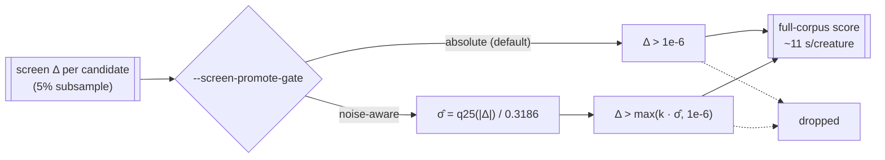

# The promote gate: absolute, or noise-aware

Issue [#111](https://github.com/stSoftwareAU/NEAT-AI-Lamarck/issues/111) —
what `--screen-promote-gate noise-aware` is, what the journals already in hand
say it would have done, and what the paired benchmark measured.

**No default is changed by this issue.** `--screen-promote-gate` defaults to
`absolute`, which is byte-for-byte the pre-#111 run.

## The two gates

The screen phase scores the candidate batch on a 5% stratified subsample and
decides which stems earn a full-corpus score — the expensive call, ~11 s per
creature against ~1 s at 5%.



[`docs/screen-calibration.md`](screen-calibration.md) measured why the absolute
gate is worth revisiting: across 244 promotions the rank correlation between
screen Δ and full-corpus Δ is **-0.55**, 85% of promotions made the creature
worse, and the `1e-6` bar sits at about **one** standard deviation of the
screen's own noise. A gate one σ wide is a coin flip.

### Why the lower quartile, and not the standard deviation

σ̂ is the **lower quartile of the batch's own absolute screen deltas**, divided
by `0.3186` — the `z` at which a standard normal puts 25% of its mass inside
`±z` — so a Gaussian batch recovers its own σ.

A candidate batch is bimodal, and that is what rules the obvious estimators out.
A real batch from the #75 `batch-40` arm, sorted:

```text
-6.66e-2 … -5.37e-2   (17 catastrophic structural proposals)
-2.27e-3 -2.27e-3 -2.27e-3 -1.35e-3 -1.67e-4 -1.41e-4 -7.36e-5
-7.67e-6 -5.79e-6 -1.24e-6 -1.24e-6 -6.22e-7 -5.84e-7 -1.48e-9 -1.48e-9 -1.48e-9
```

The standard deviation of that is `2.5e-2` and the median absolute deviation is
`1.9e-2` — both measure *proposal dispersion*, four orders of magnitude above
anything the accept bar cares about. A gate built on either would promote
nothing, ever, for the wrong reason. The lower quartile sits inside the
near-zero core, where the deltas are the smallest effects the screen can still
resolve, and returns `~4e-6` for the same batch.

The estimator's breakdown point is the quartile's: past ~25% contamination the
estimate inflates, which makes the gate *stricter* — the safe direction — and
`lamarck/src/promote_gate.rs` pins both behaviours with tests. The
`--screen-sample-rate` is deliberately **not** applied a second time: σ̂ is
measured on scores produced at the run's own rate, so the rate is already in it.

### What cannot happen

- **The gate can never be weaker than `absolute`.** The threshold is
  `max(k · σ̂, --screen-promote-threshold)`, so the promoted set is always a
  subset of what the absolute gate promotes. Acceptance is untouched: it stays
  on the full corpus at `--min-improvement`.
- **A degenerate batch falls back rather than misfiring.** Fewer than four
  candidates, a non-finite delta, or a lower quartile of exactly zero yields no
  estimate and the gate reverts to the absolute floor — it does not divide by
  zero, and it does not promote everything.

## Offline replay — would it have cost an accept?

This is the failure the gate can cause and the journal can never show: nothing
records the acceptance that never happened. So the gate is replayed against the
journals that already exist, **before** it can cost a production run anything.

```bash
cargo build --release
scripts/summarise-promote-gate.sh \
  .lamarck-baseline-45/experiments.jsonl \
  .lamarck-followup-75/*/experiments.jsonl
```

Every figure below is the `promoteGateReplay` section of
`neat_ai_lamarck report`, at the default `k = 3`:

| Journal | Gate as run | Screened | Promoted as run | Promoted under gate | Avoided | Avoided share | Accepts kept |
|---------|-------------|----------|-----------------|---------------------|---------|---------------|--------------|
| `.lamarck-baseline-45` | none (pre-#111) | 1954 | 115 | 83 | 32 | 27.8% | 2 / 2 |
| `backprop-cap-tenth` | absolute | 462 | 10 | 0 | 10 | 100% | 0 / 0 |
| `backprop-lr-tenth` | absolute | 693 | 17 | 0 | 17 | 100% | 0 / 0 |
| `batch-100` | absolute | 924 | 26 | 0 | 26 | 100% | 0 / 0 |
| `batch-150` | absolute | 660 | 17 | 0 | 17 | 100% | 0 / 0 |
| `batch-40` | absolute | 594 | 14 | 0 | 14 | 100% | 0 / 0 |
| `output-focus` | absolute | 660 | 20 | 0 | 20 | 100% | 0 / 0 |
| `seed-2` | absolute | 858 | 25 | 0 | 25 | 100% | 0 / 0 |
| **pooled** | absolute | 6805 | 244 | 83 | 161 | **66%** | **2 / 2** |

Every accepted winner these journals contain, replayed against the gate:

| Experiment | Stem | Screen Δ | Gate demanded | σ̂ | Still promoted |
|------------|------|----------|---------------|-----|----------------|
| 3 | `candidate-025` | 4.74e-6 | 1e-6 | 9.37e-8 | yes |
| 5 | `candidate-018` | 5.38e-6 | 1e-6 | 2.31e-7 | yes |

Both accepts survive with room to spare — in each of those two batches the
estimated noise was so small that `3σ̂` fell **below** the `1e-6` floor, so the
gate demanded exactly what the absolute gate demanded. The two accepts are kept
at every `k` from 1 to 5, which
`lamarck/tests/promote_gate_replay.rs::the_noise_aware_gate_would_still_have_promoted_both_historical_accepts`
asserts as a hard `cargo test` failure over committed journal fixtures.

The seven #75 arms are the other half of the picture: **129 full-corpus scores,
zero accepts**, and the gate declines every one of them. Those arms ran a
different (production) creature whose batches are dominated by catastrophic
structural proposals, so the estimated noise floor sits above every positive
screen Δ the arm produced.

### What this replay cannot support

- **It cannot establish a false-negative rate.** A candidate the screen rejected
  is never full-scored, so nothing here observes an accept the gate would have
  lost that the run never saw either. The only handle is the two accepts above —
  a sample of **two**, from one creature, from the #8 campaign only.
- **"Zero promotions" is measured on arms that accepted nothing.** It is not
  evidence that a run promoting nothing is harmless in general; a run that
  promotes nothing cannot accept anything, which is precisely the invisible
  failure the default guards against.
- **222 experiments is not 222 independent samples.** Six of the seven arms
  share seed 1 on one creature and replay much of the same experiment stream.

## Paired benchmark

Same creature, same seed, same wall budget, same `--candidates`; the only
difference is the gate. Run with:

```bash
CREATURE=... TRAIN_DATA=... SCORER=... OUT_DIR=... \
  scripts/run-followup-economics.sh promote-gate
```

<!-- BENCHMARK TABLE -->

## Decision

<!-- DECISION -->
