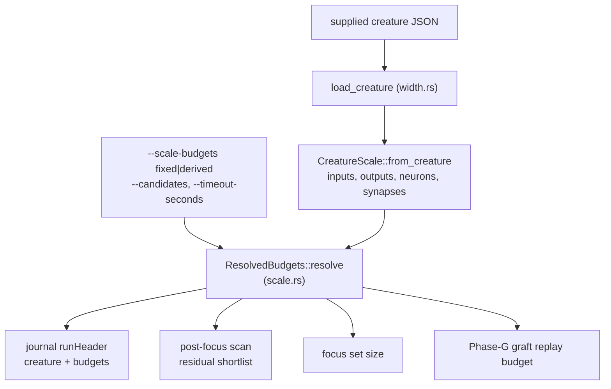

# Scale sensitivity — which constants move with the creature

Issue [#223](https://github.com/stSoftwareAU/NEAT-AI-Lamarck/issues/223).

Lamarck optimises a creature that keeps evolving. A budget calibrated once
against a particular champion stops being right the moment that champion grows,
and the failure is silent: the run still completes, it just spends its analysis
on a smaller slice of a bigger creature. This document is the inventory that
makes those decisions visible, and the record of what each one is measured to
cost.

Every constant this audit examined is listed below and classified as one of
three things. The inventory covers the areas issue #223 named — candidate count
and quota defaults, focus-count default and focus analysis cost, structural
candidate grids, scorer batch sizing, memory estimates, analysis and cache
economics, and thresholds justified by historical counts — but it is an audit,
not a proof of exhaustiveness: a constant added later is not automatically
covered here.

| Class | Meaning |
|-------|---------|
| **dimensionless** | A ratio, probability or tolerance that is independent of creature size. Correct at every scale; nothing to derive. |
| **measured** | Resolved at runtime from something the run observed — a timing, a corpus size, a per-batch σ̂. Already tracks the creature it was handed. |
| **size-dependent** | A budget whose correctness moves with the creature's width. Either derived from [`CreatureScale`](../lamarck/src/scale.rs), or a fixed literal with a stated reason. |

## How a run resolves its budgets



`ResolvedBudgets` is journalled on **both** arms, so every run — fixed or
derived — records the dimensions it was handed and the budgets it chose from
them. Nothing has to be reconstructed from the flags.

## The derivation shape

One shape is used throughout, [`sublinear_budget`](../lamarck/src/scale.rs):

```text
budget = clamp(round(gain × √population), floor, ceiling)
```

* **floor** is the pre-#223 literal, so a creature smaller than the one the
  literal was chosen for keeps exactly the old behaviour;
* **√population** because the budgets bound work that is linear in the budget
  and the coverage they buy is a sample, not an enumeration — quadrupling the
  creature doubles the budget;
* **ceiling** because an unbounded budget lets one analysis eat the run.

No creature's dimensions appear in the formula. The GRQ numbers quoted below are
benchmark evidence, never inputs to behaviour.

## Inventory

### Derived under `--scale-budgets derived`

| Constant | Fixed value | Class | Derivation |
|----------|-------------|-------|------------|
| `residual_shortlist` (`structural.rs`) | `48` sources | size-dependent | `sublinear(48, ranked_sources, gain 2.0, cap 512)`. The head of the target-correlation ranking that the residual pass re-scores; the population is every input and non-input neuron. |
| `residual_hidden_extra` (`structural.rs`) | `16` sources | size-dependent | `sublinear(16, ranked_sources, gain 0.5, cap 128)`. Unused non-input sources folded in beyond the head. |
| `synthetic_probes` (`structural.rs`) | `64` rows | size-dependent | `sublinear(64, inputs, gain 3.0, cap 512)`. The fallback ranking used only when the corpus yields fewer than two records, so it is the sole spread a wide creature's sources are judged on. It does **not** make the fit well-determined — 150 rows is as rank-deficient in 2 511 dimensions as 64 — it widens the sample the ranking is drawn from. |
| `DEFAULT_FOCUS_COUNT` (`config.rs`) | `1` focus | size-dependent | `sublinear(1, non_input_neurons, gain 0.125, cap 16)`, then capped by the candidate budget (≥ 8 candidates per focus) and the clock (≥ 60 s per focus). The creature-wide **pre**-focus scan is paid once per experiment whatever the focus count, so a wider creature amortises it over more focuses. |

> **The two derived budgets multiply.** `scan_post_focus` runs *per focus*, not
> once per experiment, so a run at K focuses pays K post-focus scans — each with
> the widened shortlist above. On a 7 363-neuron creature the derived arm
> resolves 9 focuses and a 172-source shortlist, so the analysis cost per
> experiment is roughly `9 × 3.6` times the fixed arm's, not `1.006` times it.
> The benchmark below fixes the focus count at 1 and measures the shortlist
> alone; pricing the product is the run-economics A/B's job, and is the main
> reason this arm is still opt-in. The analysis memo also holds one entry per
> focus scan, so a high focus count shortens its reach (see below).

### Resolved from the wall clock, on both arms

| Constant | Value | Class | Note |
|----------|-------|-------|------|
| `DEFAULT_GRAFT_REPLAY_BUDGET_FRACTION` (`grafts.rs`) | `0.10` of `--timeout-seconds` | dimensionless ratio, budget-derived value | Already derived; #223 records the **resolved** millisecond value in the header, which previously read `null` whenever the default fraction was used. |
| `baseline_drift_epsilon` (`baseline.rs`) | auto | measured | `ε_f32 · error · log₂(records) · headroom`, from the corpus the run scanned. |
| `estimate_corpus_records` (`baseline.rs`) | — | measured | Corpus bytes ÷ `TrainingDataConfig::bytes_per_record(creature.input, creature.output)` — already creature-width aware. |
| records per read (`chunks.rs`) | `READ_BATCH_BYTES / record_bytes` | measured | Derived from the creature's own record width; the 64 KiB constant is a cache-locality bound, not a creature assumption. |

### Size-dependent, deliberately still fixed

Each of these is a budget whose correctness moves with creature size, left fixed
for a stated reason. They are listed so the choice is visible rather than
forgotten.

| Constant | Value | Why it stays fixed |
|----------|-------|--------------------|
| `DEFAULT_CANDIDATE_COUNT` (`config.rs`) | `100` | The right batch size is a function of **measured** per-creature scorer seconds and the remaining wall clock, not of creature width — a wide creature on a fast scorer wants a big batch. Deriving it from a size constant would embed exactly the assumption #223 removes. `--candidates` stays the operator's knob and is journalled under `budgets.candidates`. |
| `PRIOR_COST_SECONDS` (`strategy_allocation.rs`) | `10.0` s | Same argument: it stands in for one full-corpus score, which `scorer_cost.rs` already measures per run. Feeding the measured fit back into the allocator is a behavioural change to the allocator, not to scale handling. |
| `MAX_COMBO_CANDIDATES` (`combos.rs`) | `50` | A scorer batch size. Bounded by the scorer's own memory and the directory-call cost, both measured at the scorer boundary (`scorer_cost.rs`), not by the creature's neuron count. |
| `ANALYSIS_CHUNK_RECORDS` (`chunks.rs`) | `2048` | Must stay fixed: the chunk boundary is what makes float summation deterministic across worker counts. Its *footprint* scales with record width, which is bounded by the read batch above. |
| `DEFAULT_ANALYSIS_THREADS` (`chunks.rs`) | `4` | Host-dependent, not creature-dependent. |
| `DEFAULT_ANALYSIS_MEMO_ENTRIES` (`memo.rs`) | `16` entries | Entry *count* is set by the measured focus reuse rate (`docs/baseline-economics.md`), a property of the focus policy rather than of creature width. Its **footprint is not**: each entry holds a `PostFocusScan`, whose `ranked_sources` is the full O(inputs + neurons) prior list, so 16 entries on a 7 363-source creature is tens of MB rather than the fan-in-bounded figure `memo.rs` claims. The count stays fixed because bounding it by bytes needs a measured entry size the run does not yet take; the discrepancy is recorded here rather than left in the module doc. |
| `DEFAULT_FAILED_CACHE_MAX_ENTRIES` / `FAILED_CACHE_BYTES_PER_ENTRY` (`failed_cache/store.rs`) | `50 000` / `512` B | The fingerprint strings are bounded by the mutation description, not by the creature. The resident-bytes ceiling derived from them (`DEFAULT_CACHE_MAX_RESIDENT_BYTES`) is enforced, so an under-estimate costs entries, never memory. |
| `DEFAULT_QUICK_SAMPLE_RECORDS` (`observations.rs`) | `25 000` | A sample size for a statistics scan, capped so quick mode stays quick. Scan time per record does scale with input width — the operator flag `--quick-sample-records` is the lever, and it is journalled. |
| `FILL_PER_STRATEGY`, `ADDS_PER_ROUND`, `NEURONS_PER_ROUND`, `HIDDEN_NEURONS_PER_ROUND` (`candidates.rs`) | `3` / `4` / `3` / `2` | Per-round quotas over a grid whose width is `ranked_sources × scale_steps`, so a wider creature takes more rounds to sweep the same fraction. Under the default `--scale-candidate-quotas` the generator keeps issuing rounds until the batch budget is filled, so `--candidates` — not these quotas — is what binds. Raising them changes the strategy *mix* of a batch, which is `--strategy-allocation`'s job (issue #218). |
| `BACKFILL_PROPOSAL_BUDGET_MULTIPLE` (`failed_cache/filter.rs`) | `2` | Already scales: it is a multiple of the batch size, not an absolute count. |
| `DEFAULT_CACHE_STAND_DOWN_MARGIN_MS` / `DEFAULT_CACHE_STAND_DOWN_WINDOW` (`failed_cache/economics.rs`) | `1 000` ms / `20` experiments | The margin is compared against **measured** scorer savings, which do grow with creature size — so on a bigger creature the guardrail trips *less* readily, which is the safe direction (the cache stands down only when it is measurably not paying). The window is a count of experiments, and experiment throughput is itself creature-dependent; both are journalled and flag-settable. |
| `PHASE0_MSE_BATCH_RECORDS` (`parity.rs`) | `1 024` records | A SIMD packing width. Its footprint is `1 024 × record width`, bounded the same way the read batch is; the count itself is a vectorisation constant, not a coverage budget. |
| `DEFAULT_FOCUS_NEIGHBOURHOOD_EDGES` / `_NEURONS` / `_RADIUS` (`config.rs`) | `4` / `0` / `1` | A *local* region by definition: the point of issue #222 is a bounded neighbourhood, so widening it with the creature would defeat the mechanism. Expansion is off by default and has its own A/B. |
| `MIN_CALIBRATION_PAIRS` / `CALIBRATION_WINDOW` (`screen_thresholds.rs`) | `8` / `128` pairs | Sample sizes for a statistical estimate, set by the variance of the estimate rather than by the creature it was measured on. |

### Dimensionless — correct at every scale

`OLS_WEIGHT_FRACTION`, `MAX_NEW_WEIGHT`, `TARGET_PRE_DELTA`, `MIN_ACT_STD`,
`GRID_WEIGHT_FLOOR`, `ADD_SCALE_STEPS`, `STACK_DAMPEN_EXPONENT`,
`DEFAULT_MIN_IMPROVEMENT`, `DEFAULT_SCREEN_SAMPLE_RATE`,
`DEFAULT_SCREEN_PROMOTE_THRESHOLD`, `DEFAULT_SCREEN_PROMOTE_SIGMA_K`,
`DEFAULT_SCREEN_CONTROL_RATE`, `DEFAULT_STRATEGY_EXPLORATION_FLOOR`,
`DEFAULT_STRATEGY_EVIDENCE_DECAY`, `INCUMBENT_CHANGE_RETENTION`,
`FOCUS_DEPTH_DECAY`, `FOCUS_SIGNAL_EPS`, the failed-cache tolerances, and the
strategy-priors half-lives are all ratios, probabilities, tolerances or
wall-clock periods. None of them moves with creature size.

`--screen-promote-gate noise-aware` is the model to copy where a threshold *does*
need a scale: it prices each batch against that batch's own measured σ̂ rather
than against a constant.

## Measured economics

`lamarck/examples/scale_budgets_bench.rs` runs the post-focus analysis scan
under both arms over an identical creature and corpus, and reports the minimum
of the repeats. Synthetic creatures, in-process scan, no scorer — so the two
arms differ only in the shortlist they fold.

```bash
cargo run --release --example scale_budgets_bench -- 8000 3 "2511:1590:12,2511:4852:9"
```

Measured 2026-09-06 on a 7-core Linux container, release profile, 8 000
records, best of three repeats per arm. Two independent runs of the same
command are shown, because the difference between the arms is smaller than the
drift between runs:

| Creature (in:hidden:fan-in) | Neurons | Synapses | Ranked sources | Fixed shortlist | Derived shortlist | Fixed ms | Derived ms | Ratio |
|---|---:|---:|---:|---:|---:|---:|---:|---:|
| `2511:1590:12` — historical GRQ shape | 4 102 | 20 670 | 4 101 | 48 (+16) | 128 (+32) | 225 / 219 | 226 / 220 | 1.00× |
| `2511:4852:9` — current large shape | 7 364 | 48 520 | 7 363 | 48 (+16) | 172 (+43) | 665 / 657 | 669 / 659 | 1.01× / 1.00× |

At 2 000 records the same shapes measure 63 ms / 63 ms and 206 ms / 206 ms.

**What this says.** The residual scan's cost is dominated by the per-record
forward pass through the creature, not by the shortlist it folds. Widening the
shortlist from 48 to 172 sources on the larger creature — from **0.65 %** to
**2.3 %** of its ranked sources — cost **under 1 %** more analysis time, which
is inside the run-to-run drift on this host. The fixed literal was not buying
speed; it was simply the coverage a smaller creature happened to need.

**What this does not say.** Whether wider coverage finds better candidates is a
run-economics question — accepts and score improvement per wall-clock hour — and
needs the real creature, the real corpus and exclusive scorer time. Until that
paired A/B is run, `--scale-budgets` stays **opt-in** and `fixed` is the arm
`derived` is measured against.

## Historical creature dimensions (external evidence)

Dated evidence about creatures this optimiser has been pointed at. Nothing here
is a design target, and no value below appears in the crate as behaviour.

| Date | Creature | Inputs | Outputs | Neurons | Synapses |
|------|----------|-------:|--------:|--------:|---------:|
| 2025-10 | GRQ champion (`../GRQ-cluster/network.json`) | 2 511 | 1 | ~1 591 | ~21 000 |
| 2026-09 | GRQ sampler history, as reported in issue #223 | 2 511 | 1 | ~7 363 | ~49 000 |

The measured economics elsewhere in `docs/` were taken at the 2025-10 shape and
are labelled as such; a re-measure at the current shape is owed for anything
priced in scorer seconds, which needs exclusive box time on the production
scorer.

## Tooling

* [`lamarck/src/scale.rs`](../lamarck/src/scale.rs) — `CreatureScale`,
  `ResolvedBudgets`, `ResidualLimits`, `sublinear_budget`.
* [`lamarck/examples/scale_budgets_bench.rs`](../lamarck/examples/scale_budgets_bench.rs)
  — the paired analysis benchmark above.
* [`lamarck/tests/scale_budgets.rs`](../lamarck/tests/scale_budgets.rs) — budgets
  across materially different creature sizes, and the journalled header.
* [`lamarck/tests/scale_sensitivity_doc.rs`](../lamarck/tests/scale_sensitivity_doc.rs)
  — this document against the code it quotes.
