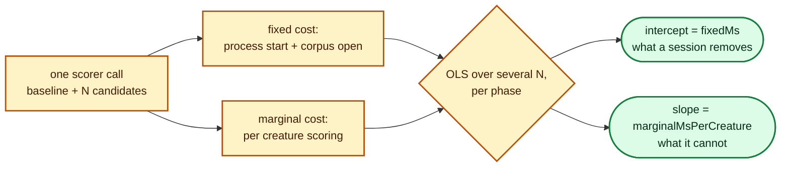

# Scorer per-call cost: fixed vs marginal (issue #112)

Lamarck invokes the scorer as a **one-shot subprocess per batch**
(`ExternalScorer::score_directory_sampled`, `lamarck/src/scorer.rs`): spawn
`rust_scorer`, hand it a candidates directory and the training-data path, read
JSON from stdout, exit. Every screen call and every promote call is a fresh
process that opens the training corpus from scratch, and scorer time is ≈83% of
a run's wall clock ([`baseline-economics.md`](baseline-economics.md)). Nobody had
measured what one call costs **before** it scores its first creature.

This document measures that, decides whether a persistent scoring session is
worth its cross-repo protocol change, and says what the measurement cannot
support.

## Method

The cost of one call is modelled as a straight line in the number of creatures
the call was handed:

```text
call ms  ≈  fixedMs  +  marginalMsPerCreature × creatures
```

The intercept is what a persistent session could remove — process start, corpus
open, per-run setup, paid once per call today. The slope is what it could not —
the actual scoring work. Both come from ordinary least squares
(`lamarck/src/scorer_cost.rs`), fitted **per phase**: a sampled screen call and a
full-corpus promote call have different marginal costs, so one line through both
would report neither.

Two measurement paths produce the same decomposition, from the same fitting code:

1. **Direct sweep — no scorer changes.** `scripts/measure-scorer-call-cost.sh`
   builds a directory of `baseline + N` creatures for several `N` and times the
   ordinary directory call at a chosen sample rate
   (`lamarck/examples/scorer_call_cost_bench.rs`). Candidates are the production
   creature with one bias nudged, so every file differs in content — an
   identical-file batch could be collapsed by a content-addressed cache and would
   measure nothing.

   ```bash
   SIZES=0,1,29 RATES=0.05,1 REPEATS=3 scripts/measure-scorer-call-cost.sh \
     ../GRQ-cluster/network.json .lamarck/train-data \
     ../NEAT-AI-scorer/target/release/rust_scorer
   ```

2. **From any run's journal.** Every scorer invocation a run makes is now
   recorded with its creature count, sample rate and wall clock — Phase-0,
   Phase-G graft replay, screen, promote and combo alike — as `scorerCalls[]` on
   the experiment (or graft-replay) line, and on its own `scorerCalls` line for
   the Phase-0 call that belongs to no experiment. `neat_ai_lamarck report` fits
   the same regression over them and reports it as `scorerCallCost` — the shape
   (values illustrative; the measured ones are under [Result](#result)):

   ```json
   "scorerCallCost": {
     "calls": 0, "failedCalls": 0, "creaturesScored": 0,
     "byPhase": {
       "screen": { "calls": 0, "distinctSizes": 0, "meanCreatures": 0,
                   "meanMs": 0, "fixedMs": null,
                   "marginalMsPerCreature": null, "rSquared": null,
                   "fixedMsShareAtMean": null }
     }
   }
   ```

   `fixedMs` / `marginalMsPerCreature` are `null` for a phase whose calls were
   all the same size — one batch size carries no slope information, and an
   intercept invented from it is exactly the mis-measurement a go/no-go must not
   rest on. A journal written before `scorerCalls` existed reports an empty
   bucket rather than a fabricated one.



## Conditions

| Item | Value |
|------|-------|
| Host | 10-core Apple M4, 24 GiB RAM, macOS |
| Creature | GRQ champion `../GRQ-cluster/network.json` — 2511 inputs, 1 output, 1605 non-input neurons, 22 016 synapses |
| Corpus | 21 GiB, 522 `*.bin` files (the `#75` baseline campaign corpus) |
| Scorer | `NEAT-AI-scorer/target/release/rust_scorer`, locked two-argument form; CPU directory mode (the scorer's own GPU auto-fallback chose CPU) |
| Batch sizes | 1, 2 and 30 creatures (baseline + 0, 1, 29 candidates) |
| Repeats | 3 sweeps at `--sample-rate 0.05`; 2 sweeps on the full corpus |
| **`loadBefore` / `loadAfter`** | **0.05 sample: 24.77 → 24.77. Full corpus: 8.80 → 25.68** (1-minute load average) |
| Competing work | **A live production Lamarck run held the box throughout**, its own `rust_scorer` at 700–800% CPU. This is *not* an idle box — see the limits below. |

Raw logs, committed beside this document:
[`docs/evidence/scorer-call-cost/rate-0_05.log`](evidence/scorer-call-cost/rate-0_05.log)
and [`docs/evidence/scorer-call-cost/rate-1.log`](evidence/scorer-call-cost/rate-1.log).

## Result

Measured 2026-08-12 (15 calls, 0 failures):

| Phase | Sample rate | Calls | `fixedMs` (intercept) | `marginalMsPerCreature` (slope) | `rSquared` | `fixedMsShareAtMean` |
|-------|-------------|-------|-----------------------|----------------------------------|------------|----------------------|
| screen | `0.05` | 9 | **9 898 ms** | 452 ms | 0.957 | 66.5% (at 11 creatures) |
| promote | full corpus | 6 | **1 977 ms** | 5 490 ms | 0.973 | 3.2% (at 11 creatures) |

The raw calls behind the screen fit make the intercept hard to argue with:
scoring **one** creature on a 5% sample takes ≈10.3 s, of which ≈0.45 s is
scoring. Scoring 30 takes ≈23.5 s. Contention inflates both numbers, but nothing
about contention can turn 0.45 s of work into a 10 s call.

Restated at the batch sizes a production run actually uses (the `#75` baseline
campaign's own mean batch: 27 creatures screened, 5.4 promoted):

| Call | Predicted total | of which fixed |
|------|-----------------|----------------|
| screen, 27 creatures | 22.1 s | 9.9 s — **45%** |
| promote, 5.4 creatures | 31.6 s | 2.0 s — **6%** |

Screen calls are where the fixed cost lives, and screen calls are the majority:
the 45-minute baseline run made **75 screen calls, 26 promote calls and 1
Phase-0 call** for 2 236 s of scorer time (82.6% of its analysis+scorer time).

Two projections of the fixed cost over that run, deliberately computed two ways:

| Projection | Method | Fixed cost | Share of scorer time | Share of analysis+scorer |
|------------|--------|------------|----------------------|--------------------------|
| Direct | measured intercepts × that run's call mix | 796 s | 35.6% | 29.4% |
| Load-corrected | measured fixed **shares** applied to that run's own measured scorer time | ≈650 s | ≈29% | ≈24% |

The load-corrected row exists because the measurement's absolute screen-call time
(22.1 s at 27 creatures) is ≈57% higher than the baseline campaign's own
(14.1 s) — this box was busier than that one. A *share* survives proportional
inflation where an absolute intercept does not, so the two rows bracket the
answer: **the fixed per-call cost is 24–29% of a 45-minute production run**,
about 11–13 minutes of every 45.

A secondary finding worth its own line: the **sampled** call's fixed cost
(9.9 s) is five times the full-corpus call's (2.0 s), while doing a twentieth of
the scoring. Whatever the `--sample-rate` path does before it scores, the
streaming full-corpus path does not — and that is a scorer-side cost that might
be removable without any protocol change at all.

## Decision

**Go** — a persistent scoring session is worth pursuing, and it is the largest
single item found so far in the [#102](https://github.com/stSoftwareAU/NEAT-AI-Lamarck/issues/102)
survey.

- **Estimated saving.** A session that opens the corpus once pays the fixed cost
  once instead of ~102 times: **≈24–29% of a 45-minute run, ~11–13 minutes**, and
  it compounds with every change that raises experiments per hour, because a
  faster loop makes *more* calls and pays the fixed cost more often. Even a
  half-effective session — one that removed only the screen-call component —
  returns ≈20% of the run (742 s of the 796 s direct estimate is screen calls).
  That is comfortably above the ~15% the issue set as the level worth a
  cross-repo protocol change.
- **But not necessarily as a session first.** The cheapest shape of this win may
  not be a long-lived process at all: the 5× gap between the sampled and
  full-corpus intercepts says the sampling path itself carries a per-call cost.
  Removing that inside the scorer would need **no** wire protocol, no supervised
  process, and none of the failure modes (hung session, stale corpus, partial
  read) that issue #112 flags as the real risk of a session.
- **Coordinate before building.** The right home for a persistent mode is the
  scorer repo, with this repo owning the client side. The scorer-side throughput
  survey **NEAT-AI-scorer#536** is closed, so the follow-up is cross-referenced
  to it rather than blocked on it, and it must be agreed with the scorer before
  any protocol is cut.
- **Re-measure on an idle box before sizing the work.** The decision to
  *investigate* is safe on these numbers; the number quoted in a design should
  come from a repeat with no competing scorer.

Follow-up: [#123](https://github.com/stSoftwareAU/NEAT-AI-Lamarck/issues/123) —
remove the per-call fixed scorer cost, cross-referenced to NEAT-AI-scorer#536.

**No change was made to the scoring path in this issue.** The only behaviour
added is measurement: per-call records in the journal and their regression in
`report`.

## What this measurement cannot support

- **It was taken on `not an idle box`.** A live production Lamarck run held
  7–8 of the 10 cores for the whole measurement, exactly the contamination
  [`followup-economics.md`](followup-economics.md) warns about. Both the
  intercept and the slope are inflated by it. The direction matters for the
  decision: the *slope* is CPU-bound and competes directly with the other
  scorer, while the *intercept* is dominated by I/O and start-up, so contention
  inflates the slope at least as much as the intercept — which means the fixed
  **share** measured here is a floor, not a ceiling. A repeat on a genuinely
  idle box is still owed before the saving is quoted to a decimal place.
- **It cannot attribute the fixed cost inside the scorer.** Lamarck measures the
  call from outside the process, so `fixedMs` is process start *plus* corpus open
  *plus* whatever else the scorer does before its first creature. Which of those
  dominates — and therefore how much of it a persistent session could actually
  remove — is a scorer-side question, and belongs with the scorer's own
  throughput survey (NEAT-AI-scorer#536).
- **Three batch sizes, one creature, one corpus.** The line is fitted over 1, 2
  and 30 creatures on one creature and one corpus. It says nothing about a
  different corpus size, a different creature shape, or non-linearity between 2
  and 30 creatures.
- **Page cache.** Repeated sweeps over a 21 GiB corpus on a 24 GiB host warm the
  cache, so a run's *first* call plausibly pays more than the fitted intercept.
  That also biases the measured fixed cost downwards.

## Reproducing it

```bash
# Direct sweep (needs the production creature, corpus and scorer):
SIZES=0,1,29 RATES=0.05,1 REPEATS=3 scripts/measure-scorer-call-cost.sh \
  ../GRQ-cluster/network.json .lamarck/train-data \
  ../NEAT-AI-scorer/target/release/rust_scorer

# Or from any run's journal, at no box cost:
neat_ai_lamarck report .lamarck/experiments.jsonl | jq .scorerCallCost
```

The regression itself is pinned by fixture tests — `lamarck/src/scorer_cost.rs`
for the fit and `lamarck/src/report.rs` for the journal path — which assert the
recovered intercept and slope exactly, per phase, from known call sizes and
times. `lamarck/src/run.rs` additionally asserts that the journalled call count
matches the run's own scorer success/failure totals, so a call that never
reached the journal fails `./quality.sh` rather than quietly biasing an
intercept.
