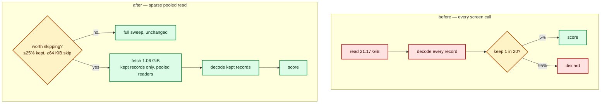

# Removing the fixed per-call scorer cost (issue #123)

[`scorer-call-cost.md`](scorer-call-cost.md) (issue #112) measured what a scorer
call costs **before it scores its first creature**: **9 898 ms** on a 5% sample
against **1 977 ms** on the full corpus — five times the fixed cost for a
twentieth of the scoring work, and 24–29% of a 45-minute run. Issue #123 is the
fix.

Two shapes were on the table, cheapest first: **(1)** fix whatever the
`--sample-rate` path pays that the streaming full-corpus path does not, or
**(2)** build a persistent scoring session. Shape (1) reached the bar, so a
**persistent scoring session was not built** — no wire protocol, no supervised
process, none of a session's failure modes.

## The root cause

The scorer sub-samples **after decode**: `for_each_read_chunk` streamed every
byte of the 21 GiB corpus, `unpack_f32s_le` decoded every byte into `f32`, and
only then did `RecordSampler::filter_in_place` drop 95% of the records. A screen
call therefore paid the whole corpus read *and* the whole decode to score a
twentieth of it. That is exactly the cost the full-corpus call does not show:
with ~5.5 s of scoring per creature to hide behind, its read overlaps with real
work, so it never surfaces as an intercept.

The fix is to stop asking for the bytes. A sampled directory call now fetches
only the records it will score.



## Where the fix lives

Lamarck owns the client side, and the client side needed **no change**: the fix
is transparent, behind the same fire-and-forget subprocess call and the same
`--sample-rate` / `--sample-phase` flags.

| Repository | Change | Branch |
|---|---|---|
| NEAT-AI-core | `training_bin_stream::for_each_sampled_read_chunk` — fetch only the records a `keep(global_record_index)` predicate selects, over a pool of readers, delivered in corpus order; `sampled_read_is_worthwhile` declines the sparse path when it would lose | `issue-scorer-sampled-read` |
| NEAT-AI-scorer | `stream_io::sweep_corpus` picks the reader for every directory sweep (CPU, synchronous GPU, pipelined GPU); the stride stays owned by `sampling::SampleSpec`, so there is one kept-set definition | `issue-lamarck-123-sampled-read` |
| NEAT-AI-Lamarck | this measurement and document | — |

Cross-referenced to the scorer-side throughput survey
[NEAT-AI-scorer#536](https://github.com/stSoftwareAU/NEAT-AI-scorer/issues/536),
as issue #112's go/no-go required.

## The negative result that shaped it

Skipping bytes is not free: it trades sequential bandwidth for seeks. Read the
kept records **one thread at a time** and the sampled path is *slower* than
reading everything, on this very corpus:

| Read (rate 0.05, 10 048 B/record) | Bytes fetched | Wall |
|---|---|---|
| full sequential sweep | 21.17 GiB | 5.0–6.2 s |
| sampled, 1 reader | 1.06 GiB | 9.8–31.8 s |
| sampled, 8 readers | 1.06 GiB | 1.73 s |
| sampled, 16 readers | 1.06 GiB | **1.27 s** |

So the reader is a **pool** by construction, and the sparse path is taken only
when the arithmetic supports it — at least 75% of records skipped, and skips of
at least 64 KiB. A denser sample, or a corpus of small records, keeps the
sequential sweep.

## Result

Measured with the same harness #112 used
(`scripts/measure-scorer-call-cost.sh` → `lamarck/examples/scorer_call_cost_bench.rs`
→ the `lamarck/src/scorer_cost.rs` regression), on the production creature
(2 511 inputs, 22 104 synapses) and the 21 GiB / 520-file corpus, at
`--sample-rate 0.05`, 3 sweeps of 1/2/30 creatures:

| Screen call | `fixedMs` | `marginalMsPerCreature` | mean call (11 creatures) | `r²` |
|---|---|---|---|---|
| before (`NEAT_SCORER_SAMPLED_READ=off`) | **10 693 ms** | 597 ms | 17 260 ms | 0.786 |
| after | **3 423 ms** | 805 ms | 12 282 ms | 0.989 |

**The fixed cost of a screen call falls by 68%.** Logs:
[`before/rate-0_05.log`](evidence/scorer-fixed-cost/before/rate-0_05.log),
[`after/rate-0_05.log`](evidence/scorer-fixed-cost/after/rate-0_05.log).

The two sweeps ran minutes apart on a box whose load was still climbing, so they
are also confirmed by an **interleaved** A/B — one call each way, alternating,
four pairs, 1-minute load 33.9–35.3 throughout
([`interleaved-rate-0_05.log`](evidence/scorer-fixed-cost/interleaved-rate-0_05.log)):

| Pair | `off` | `on` |
|---|---|---|
| 1 | 11 522 ms | 5 925 ms |
| 2 | 10 787 ms | 5 684 ms |
| 3 | 12 397 ms | 3 045 ms |
| 4 | 10 868 ms | 3 450 ms |
| **median** | **11 195 ms** | **4 567 ms** |

A 1-creature screen call is **59% faster**, and every pair agrees.

Projected onto the [#75](https://github.com/stSoftwareAU/NEAT-AI-Lamarck/issues/75)
baseline run's own call mix (75 screen calls, 26 promote calls, 1 Phase-0 call),
#112's direct estimate attributed **742 s** of that 45-minute run to screen-call
fixed cost. A 68% cut returns ≈**500 s — about 8 minutes of every 45, ~19% of
the run** — which is the "~20% of a run with no protocol change" #112 predicted
for exactly this fix.

## Scores do not move

This touches the authoritative scoring path, so a different number would be a
correctness bug, not a performance one. Three things hold the line:

- The sampled reader delivers **the same records in the same order** — segment
  `k` is read by reader `k % readers` and pulled back in `k` order — so a
  creature's error sum accumulates identically whatever the pool size.
- `rust_scorer/tests/sampled_read_parity.rs` scores a production-shaped corpus
  through both readers at three rate/phase combinations and asserts
  **bit-identical** `score`, `error` and `recordCount` (compared as raw bits).
- The production sweeps above report the same baseline score to every digit
  printed (`0.348985976566` at 1 creature, `0.348986599171` at 30) with the
  sampled reader on and off.

A full-corpus call — Phase-0 parity, promote, full-corpus acceptance — does not
change path at all: `sampled_read_is_worthwhile` declines a full-rate sample, so
those calls take the byte-for-byte sequential sweep they always did.

`NEAT_SCORER_SAMPLED_READ=off` restores the old reader on a host where sparse
reads misbehave. It is an escape hatch, not configuration.

## Conditions, and what this measurement cannot support

| Item | Value |
|------|-------|
| Host | 10-core Apple M4, 24 GiB RAM, macOS |
| Creature | GRQ champion `../GRQ-cluster/network.json` — 2 511 inputs, 1 output, 1 613 neurons, 22 104 synapses |
| Corpus | `/Users/sloth/GRQ/.trainData-binary_116` — 520 `*.bin`, 21.17 GiB, 10 048 B/record |
| Scorer | `NEAT-AI-scorer@issue-lamarck-123-sampled-read`, release build, CPU directory mode |
| **`loadBefore` / `loadAfter`** | **before: 20.61 → 28.89. after: 27.58 → 36.65. interleaved: 33.9–35.3 throughout** |
| Competing work | **A live production run held the box throughout** — this is not an idle box |

- **It was not taken on an idle box.** Issue #123 asked for a repeat with no
  competing scorer; the box was running production the whole time, at a 1-minute
  load of 20–37. The interleaved A/B is the mitigation — load was matched within
  a pair, and every pair moved the same way — but the *absolute* millisecond
  figures are inflated, and the fixed cost is a floor rather than a number to
  quote to a decimal place. **Owed: a repeat on a quiet host.**
- **The before/after arms differ by the escape hatch, not by binary.** "Before"
  is `NEAT_SCORER_SAMPLED_READ=off`, which takes the identical code path the
  pre-change scorer took, so the comparison isolates the reader rather than a
  rebuild. It is not a comparison against a separately built old binary.
- **It is a per-call measurement, not a run.** #123's acceptance also asks for
  the reduction to show in the `scorerCallCost` regression of `report` over a
  **real run's journal**. That needs the two dependency PRs merged and a scorer
  release, so it is owed once a human has cut one — see the follow-up issue
  named in [`README.md`](../README.md#outstanding-work).
- **One creature, one corpus, one rate.** The line is fitted over 1, 2 and 30
  creatures at rate 0.05 on one creature and one corpus, as #112's was.

## Reproducing it

```bash
# Before (old reader) and after (sampled reader), same binary:
NEAT_SCORER_SAMPLED_READ=off SIZES=0,1,29 RATES=0.05 REPEATS=3 \
  scripts/measure-scorer-call-cost.sh ../GRQ-cluster/network.json \
  <corpus> ../NEAT-AI-scorer/target/release/rust_scorer docs/evidence/scorer-fixed-cost/before
SIZES=0,1,29 RATES=0.05 REPEATS=3 \
  scripts/measure-scorer-call-cost.sh ../GRQ-cluster/network.json \
  <corpus> ../NEAT-AI-scorer/target/release/rust_scorer docs/evidence/scorer-fixed-cost/after
```

The scorer must be built from `issue-lamarck-123-sampled-read` beside a
NEAT-AI-core checked out at `issue-scorer-sampled-read`; both are path
dependencies of the same sibling layout this repo already assumes.
