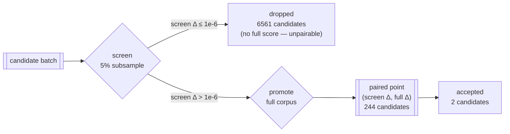

# How well the 5% screen predicts the full-corpus score

Issue [#110](https://github.com/stSoftwareAU/NEAT-AI-Lamarck/issues/110) — a
measurement, from journals already in hand. **No box time was spent on it**, and
**no default is changed by it.**

The screen phase decides which candidates are worth a full-corpus score: it
scores the batch on a 5% stratified subsample (`--screen-sample-rate 0.05`) and
promotes anything beating the subsample baseline by more than
`--screen-promote-threshold` (`1e-6`). Full-corpus scoring is the expensive
call — 2 262 277 records against ~113 000 at 5% — so every promotion the full
corpus then contradicts is scorer time bought for nothing.

Both numbers are already journalled per experiment (`screenScores` and
`scores`), so every `experiments.jsonl` is a paired sample waiting to be read.

## Reproduce

```bash
cargo build --release
scripts/summarise-screen-calibration.sh \
  .lamarck-baseline-45/experiments.jsonl \
  .lamarck-followup-75/*/experiments.jsonl
```

Every figure below comes from the `screenCalibration` section of
`neat_ai_lamarck report`, so the document and the binary cannot drift apart:

```bash
neat_ai_lamarck report experiments.jsonl | jq .screenCalibration
```

## What is paired, and what is not



Pairing rules, each pinned by a fixture in
`lamarck/src/screen_calibration.rs`:

- only the **intersection** of the two stem sets is paired; screened-but-not-
  promoted candidates are counted (`screenOnlyCandidates`) rather than dropped
  silently, and a promote-side stem with no screen score of the same name is
  counted too (`fullOnlyCandidates`, `0` in every journal here),
- `baseline` is excluded from **both** sides — it is the anchor each Δ is
  measured against, and pairing it would pin the correlation near 1,
- a journal with no screen phase reports `screenEnabled: false` and a `null`
  correlation rather than a fabricated one,
- a score map with no `baseline` fails loudly instead of being skipped.

**The paired sample is the promoted set only.** Nothing here observes what the
screen threw away, so every figure below is conditional on promotion. That
matters most for the noise floor and is stated again where it bites.

## Journals analysed

| Journal | Knobs (from `runHeader`) | Exps |
|---------|--------------------------|------|
| `.lamarck-baseline-45` | the #8 baseline: 45 min, `--candidates 100`, seed 1, weighted focus. Pre-#71, so it carries **no run header** — its knobs come from `docs/baseline-economics.md` | 75 |
| `output-focus` | `--focus-neuron output-0`, 2700 s, seed 1 | 20 |
| `batch-40` / `batch-100` / `batch-150` | `--candidates` 40 / 100 / 150, 900 s, seed 1 | 18 / 28 / 20 |
| `backprop-lr-tenth` | `--backprop-learning-rate 0.001`, 900 s, seed 1 | 21 |
| `backprop-cap-tenth` | backprop cap arm, 900 s, seed 1 | 14 |
| `seed-2` | production config, **seed 2**, 2700 s | 26 |

All eight ran `--screen-sample-rate 0.05` and `--screen-promote-threshold 1e-6`
against the same 2 262 277-record GRQ corpus. The seven arms are the **local
calibration campaign** (`~/.lamarck-followup-75`, Lamarck `0.1.7`, mostly seed
1); they are **not** the same files behind
[`docs/followup-economics.md`](followup-economics.md) (the **scripted #75
campaign**, seeds 11 / 21 / 31), whose journals are not on disk. Both sets are
gitignore'd run output, so the tables below — not the journals — are the
committed record.

## Results

| Journal | Exps | Screened | Paired | Distinct | Rank ρ | ρ distinct | Precision | Cleared bar | Materially worse | Screen-Δ noise sd | Baseline gap sd |
|---------|------|----------|--------|----------|--------|------------|-----------|-------------|------------------|-------------------|-----------------|
| `.lamarck-baseline-45` | 75 | 1954 | 115 | 81 | -0.555 | -0.447 | 27% | 3 | 45 | 1.12e-6 | 1.49e-3 |
| `backprop-cap-tenth` | 14 | 462 | 10 | 10 | -0.317 | -0.317 | 0% | 0 | 4 | 7.52e-7 | 1.38e-3 |
| `backprop-lr-tenth` | 21 | 693 | 17 | 17 | -0.654 | -0.654 | 0% | 0 | 9 | 1.09e-6 | 1.39e-3 |
| `batch-100` | 28 | 924 | 26 | 25 | -0.449 | -0.463 | 3.8% | 0 | 11 | 8.98e-7 | 1.3e-3 |
| `batch-150` | 20 | 660 | 17 | 17 | -0.654 | -0.654 | 0% | 0 | 9 | 1.09e-6 | 1.39e-3 |
| `batch-40` | 18 | 594 | 14 | 14 | -0.509 | -0.509 | 0% | 0 | 7 | 6.94e-7 | 1.49e-3 |
| `output-focus` | 20 | 660 | 20 | 20 | -0.685 | -0.685 | 5% | 0 | 10 | 1e-6 | 1.53e-3 |
| `seed-2` | 26 | 858 | 25 | 25 | -0.343 | -0.343 | 16% | 0 | 9 | 1.25e-6 | 1.49e-3 |
| **pooled** | **222** | **6805** | **244** | **136** | **-0.549** | **-0.502** | **15.2%** | **3** | **104** | **1.06e-6** | **1.4e-3** |

- *Screened* counts every candidate that got a subsample score; *Paired* is the
  subset that also got a full-corpus score, i.e. the promotions.
- *Distinct* (`distinctPairs`) is the number of distinct (screen Δ, full Δ)
  points among the pairs. It is far below *Paired* because the generator re-proposes the same
  mutation whenever the incumbent and the focus repeat, and six of the seven
  arms share seed 1 and replay much of one experiment stream. **136 distinct
  points, not 244, is the honest sample size.**
- *Precision* is the share of promotions whose full-corpus Δ beat **zero**.
- *Cleared bar* counts promotions above the `1e-6` accept bar; *materially
  worse* counts those below `-1e-6`.

### The screen's ordering is worse than useless among what it promotes

Rank correlation between screen Δ and full-corpus Δ is **negative in every
journal**, from -0.32 to -0.69, pooled **-0.549** (-0.502 on distinct points
only). It is not that the screen is uninformative about which promoted
candidate is best — it is that its ordering is systematically *inverted*. The
single anecdote in `docs/followup-economics.md` (`random` had the second-best
screen Δ and the worst full-corpus Δ) is the general case, not an outlier.

Full-corpus Δ across the 244 promotions:

| Statistic | Value |
|-----------|-------|
| min | -4.54e-5 |
| p25 | -4.69e-6 |
| median | -5.45e-7 |
| p75 | -3.01e-7 |
| max | **+1.11e-6** |
| mean | -5.85e-6 |

**207 of 244 promotions (85%) made the creature worse**, 104 (42.6%) by more
than the accept bar itself, and exactly **3 (1.2%)** cleared it. The promote
gate is buying a lottery ticket at ~11 s of full-corpus scorer time each.

The likeliest mechanism is selection on the subsample: a 5% slice is a
different objective from the corpus, so the candidates that top it are partly
the ones that overfit the slice. Conditioning on `screen Δ > threshold` then
turns "no signal" into "negative signal" among the survivors.

### The screen's noise floor

Among the 137 pooled promotions whose full-corpus Δ landed inside ±1e-6 — the
full corpus says they changed nothing — the screen Δ was:

| Quantity | Value | Sample |
|----------|-------|--------|
| mean | 2.19e-6 | 137 pairs |
| standard deviation | **1.06e-6** | 137 pairs |
| RMS | 2.43e-6 | 137 pairs |
| max | 6.14e-6 | 137 pairs |

**The `1e-6` promote threshold is about one standard deviation of the screen's
own noise.** A gate one σ wide is a coin flip, which is exactly what the
precision column shows.

That estimate is **one-sided and therefore conservative**: only promoted
candidates have a full-corpus score, and promotion already required
`screen Δ > 1e-6`, so the left half of the noise distribution is unobservable
here. The true spread is at least this wide.

An independent, *unselected* estimate of the same sampling error comes from the
baseline, which every promoting experiment scores twice — once on the 5% slice,
once on the full corpus, on the identical creature:

| Quantity | Value | Sample |
|----------|-------|--------|
| mean gap | +1.10e-4 | 120 experiments |
| standard deviation | **1.40e-3** | 120 experiments |
| max abs gap | 2.64e-3 | 120 experiments |

A 5% subsample score is worth **±1.4e-3** as a *level* — some 1400× the accept
bar. Most of that common-mode error cancels in a Δ measured on the same slice,
which is why the Δ noise floor above is three orders of magnitude smaller; but
it is the reason a subsample baseline can never be compared with a full-corpus
one (issue #84).

### The accepts, and the false-negative risk

Every candidate ever accepted in these journals, with the screen Δ that
promoted it:

| Experiment | Stem | Screen Δ | Full-corpus Δ |
|------------|------|----------|---------------|
| 3 | `candidate-025` | 4.74e-6 | 1.11e-6 |
| 5 | `candidate-018` | 5.38e-6 | 1e-6 |

Both are from the #8 baseline; the seven follow-up arms accepted nothing. Both
sat at **4.5–5.1×** the current threshold, and at ~2× the mean screen Δ of the
promotions the full corpus scored flat.

What a higher threshold would have kept, over the pooled promotions:

| Threshold | Promotions kept | Share | Accepts kept |
|-----------|-----------------|-------|--------------|
| 1e-6 (current) | 244 | 100% | 2 / 2 |
| 2e-6 | 166 | 68% | 2 / 2 |
| 3e-6 | 104 | 42.6% | 2 / 2 |
| 4e-6 | 89 | 36.5% | 2 / 2 |
| 5e-6 | 72 | 29.5% | **1 / 2** |

**Read this table with the sample size next to it: it has two accepts in it.**
The 4e-6 row is one candidate away from losing half the evidence, and the whole
"accepts kept" column is a claim about a population of two.

## What this sample cannot support

- **It cannot price `--screen-sample-rate`.** Every journal analysed ran at
  0.05. There is no variation in the rate anywhere in the corpus of evidence,
  so nothing here says whether 2% or 10% would be better. Any statement about
  the rate would be invention.
- **It cannot establish a false-negative rate.** That needs candidates the
  screen *rejected* and the full corpus would have accepted, and a rejected
  candidate is never full-scored. The only handle is the screen Δ of the two
  accepts above — a sample of **two**, from one seed, on one creature, from the
  #8 campaign only.
- **It cannot separate "the screen is anti-predictive" from "the promoted set
  is a truncated sample".** Both produce a negative ρ. Distinguishing them
  needs full-corpus scores for candidates below the threshold, which is a
  measurement arm, not a re-read of these journals.
- **222 experiments is not 222 independent samples.** Six of the seven arms
  share seed 1 on one creature and replay much of the same experiment stream;
  244 pairs contain 136 distinct points. The #8 journal and the arms overlap in
  **zero** points (different creature), which is why the two campaigns are
  reported separately as well as pooled.
- **Two campaigns, one creature family.** The #8 baseline and the follow-up
  arms disagreed about strategy ordering
  (`docs/followup-economics.md`); nothing here should be treated as a property
  of screening in general.

## Recommendation for #111

For the promote-gate change tracked in
[#111](https://github.com/stSoftwareAU/NEAT-AI-Lamarck/issues/111):

1. **Express the threshold in noise units, not absolutes.** The measured Δ noise
   floor is **σ ≈ 1.06e-6** (137 pairs, one-sided). The current `1e-6` is ≈ 1σ.
   A gate at **3σ = 3.18e-6** would have cut promotions by **59%** (244 → 100)
   while keeping both accepts. That is the single number this analysis exists to
   produce.
2. **Treat that as a hypothesis to measure, not a default to ship.** It rests on
   two accepts. #111 should land the threshold behind a flag and gate the
   default change on **accepts per hour**, exactly as `--scale-candidate-quotas`
   (#108) and `--focus-count` (#109) were gated.
3. **`--screen-sample-rate`: insufficient evidence.** Do not move it. Pricing it
   needs an arm that varies the rate and records both scores; that is box time,
   and it is not this issue.
4. **The bigger prize may not be the threshold at all.** With ρ ≈ -0.55 the
   screen's *ranking* is inverted among promotions, so promoting the top-*k* by
   screen Δ is worse than promoting *k* at random from the survivors. A gate
   change that only moves the cut-off leaves that on the table.

No flag default is changed by this issue.

**What #111 did with it:** the gate landed as opt-in
`--screen-promote-gate noise-aware`, with σ̂ estimated per batch from the lower
quartile of its own |screen Δ| rather than from the pooled figure above — the
pooled 1.06e-6 is a cross-experiment noise floor, and a per-batch gate needs a
per-batch scale. Replayed over these same journals it avoids 66% of promotions
while keeping both accepts; see [`docs/promote-gate.md`](promote-gate.md). The
default remains `absolute`.
