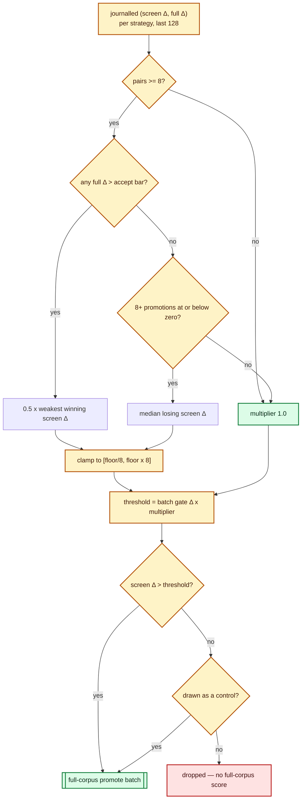

# Per-strategy screen thresholds (issue #220)

Lamarck screens every candidate on a 5% subsample and promotes what clears one
shared threshold. [`docs/screen-calibration.md`](screen-calibration.md) measured
what that buys on the journals in hand — 244 promotions, 3 clearing the accept
bar, 207 making the creature worse — but it measured it **pooled**, across every
candidate family at once.

The families are not alike. A tiny weight perturbation, a structural add, a
random change and a backprop step do not share a relationship between sampled Δ
and full-corpus Δ, so one threshold over-buys full-corpus calls for the noisy
families and prematurely drops the ones whose sample signal is weak but whose
promoted precision is good.

`--screen-threshold-mode per-strategy` learns that relationship per family and
scales the threshold accordingly. `--screen-threshold-mode shared` — the
default — keeps the pre-#220 gate as the arm it is measured against.

The implementation is
[`lamarck/src/screen_thresholds.rs`](../lamarck/src/screen_thresholds.rs), the
end-to-end tests are
[`lamarck/tests/screen_thresholds.rs`](../lamarck/tests/screen_thresholds.rs),
and the per-strategy report rows are built in
[`lamarck/src/screen_calibration.rs`](../lamarck/src/screen_calibration.rs).

## The critical guardrail

**Calibration never makes the screen authoritative.** It only decides which
candidates are worth a full-corpus score. Acceptance stays exactly where it was:
the full-corpus scorer, at `--min-improvement`, on a batch scored beside the
incumbent. Nothing in this document can accept a candidate, and no measured
threshold shortens the path from a sampled score to an incumbent swap.

## What is learned

Every candidate that was screened **and** full-corpus scored is a paired
observation `(screen Δ, full Δ)`. The journal already carries both numbers, so
the evidence costs no box time. Each observation joins the window of the
strategy that proposed it — the most recent 128 — and the threshold is drawn
from that window:

| Basis | When it applies | The threshold |
|-------|-----------------|---------------|
| `shared` | Fewer than 8 paired observations, or no usable statistic | The run's shared threshold, unchanged |
| `win-margin` | The family has at least one promotion whose full Δ cleared the accept bar | Half the **weakest** winning screen Δ |
| `loss-quantile` | No winner, and at least 8 promotions the full corpus scored at or below zero | The **median** losing screen Δ |

The result is expressed as a multiplier on the threshold the batch's own promote
gate resolved — the absolute floor, or the noise-aware `max(k · σ̂, floor)` — so
calibration composes with [the promote gate](promote-gate.md) rather than
replacing it, and is clamped to `[1/8, 8]`.



Three design choices are worth stating plainly, because each is a place a
calibration could quietly go wrong:

* **Both directions.** A family whose winners screen loudly gets a *higher* bar;
  a family that won on a screen Δ the gate could barely see gets a *lower* one.
  The issue names both failure modes, and only lowering thresholds is what
  addresses the second. Lowering a screen threshold buys more full-corpus calls;
  it cannot lower the acceptance bar.
* **A winner the screen scored at or below zero drops the family to the bounded
  minimum** rather than to a threshold computed from a number with no scale in
  it. Half of `-1e-7` is not a gate.
* **Recency, not decay.** The estimator is a quantile, and a quantile of
  fractionally weighted points is not a number anybody can check by hand. The
  window keeps it a plain order statistic over the observations closest to the
  creature the run is optimising now.

## The control sample

A rejected candidate is never full-corpus scored, so a screen only ever sees the
candidates it liked. `docs/screen-calibration.md` states the consequence
directly: that sample **cannot establish a false-negative rate**. A calibration
that could only ever tighten a threshold on that evidence would be
unfalsifiable.

`--screen-control-rate` (default `0.02`) is the fix. Under calibration, that
share of the **below-threshold** candidates is promoted anyway, drawn uniformly
at random from the rejected set using the run's seeded rng. The count is rounded
**up**, so the rate is a minimum and any rejected batch buys at least one
control — including a batch where nothing cleared the gate at all, which under
the shared threshold ends with no full-corpus call.

Two things follow, and both are what the guardrail is for:

* A control the full corpus then puts above the accept bar is a **measured false
  negative** — the only kind a screen can produce evidence for.
* A control is the only way a winner with a weak screen Δ enters the window, so
  it is the mechanism by which a family that the gate cannot see pulls its own
  threshold down.

A calibrated run with `--screen-control-rate 0` is refused at startup rather
than run: a gate that cannot measure what it discards is not a calibrated gate.

## What the journal and the report say

Each experiment under calibration carries a `screenThresholds` object: the
`modelVersion` (`per-strategy-screen-v1`), the `mode`, the `sharedThreshold` the
batch gate resolved before calibration, the `controlRate` in force, the applied
`thresholds` and `basis` per strategy, the `controls` promoted below threshold,
and one `candidates[]` entry per screened candidate carrying its own `stem`,
`strategy`, `threshold`, `modelVersion`, whether it was `promoted` and whether
it was a `control`. Every candidate is therefore traceable to the exact
threshold and estimator version that judged it. The run header records
`screenThresholdMode` under both modes and `screenControlRate` only under
`per-strategy`, where a control sample is actually promoted.

`neat_ai_lamarck report` answers the same question twice — per family, and as
economics:

| Field | Meaning |
|-------|---------|
| `screenCalibration.byStrategy[].screened`, `paired` | Candidates of that strategy the screen scored, and how many also got a full-corpus score. |
| `screenCalibration.byStrategy[].promotionPrecision` | Share of its promotions the full corpus scored above zero. |
| `screenCalibration.byStrategy[].meanScreenDelta`, `fullDelta` | Its sampled Δ, and the full-corpus Δ spread conditional on promotion. |
| `screenCalibration.byStrategy[].controlPromotions`, `controlFalseNegatives` | Controls it bought, and how many of those the full corpus then put above the accept bar. |
| `screenCalibration.byStrategy[].promoteMs` | Promote-phase scorer milliseconds its calls cost — a call's measured time split evenly across the candidates it scored. |
| `screenCalibration.byStrategy[].recommendedMultiplier`, `recommendedThreshold`, `basis` | What this journal's own evidence says its threshold should be, from the same estimator a calibrated run applies. |
| `screenThresholdReplay.promotedAsRun`, `promotedUnderCalibration` | Full-corpus scores the run bought, against what calibration would have bought. |
| `screenThresholdReplay.promotionsAvoided`, `promotionsAdded`, `controlPromotions` | The difference, with the control sample charged to the calibrated arm. |
| `screenThresholdReplay.acceptsKept`, `acceptsDropped`, `improvementDropped` | The number that decides whether the calibration is safe. |
| `screenThresholdReplay.promoteMsPerCreature`, `promoteSecondsSaved` | The journal's own measured promote cost, and what the avoided calls are worth in seconds. |
| `screenThresholdReplay.scoreImprovementPerWallHourAsRun`, `projectedScoreImprovementPerWallHour` | The gate metric as measured, and under calibration. |

The replay is offline: it re-derives the thresholds from the journal's own
records, in journal order, so a report never disagrees with the run it
describes. It is reported for a **shared** journal too, so the two A/B arms are
read off the same numbers.

**Read the projection beside `acceptsDropped`.** It assumes every kept accept
still lands and moves the wall clock only by the promote seconds saved. An arm
that drops an accept changed which creature the run was optimising from that
point on, and no replay of the remaining experiments can price that.

## The A/B

The gate metric is the one #69 and #94 already use:
`scoreImprovementPerWallHour` from `neat_ai_lamarck report` (full-corpus
anchored — do not pass `--skip-phase0`, which leaves it `null`), read beside the
full-corpus scorer calls each arm bought.

```bash
cargo build --release
CREATURE=… TRAIN_DATA=… SCORER=… \
scripts/run-screen-threshold-ab.sh              # control (shared) + calibrated, per seed
scripts/summarise-screen-thresholds.sh .lamarck-screen-thresholds
```

Both arms share a seed, so the focus stream and the candidate batch start
identical and only the promote decision moves. Repeats are required: on a
creature where accepts are rare, one pair is an anecdote — the #75 campaign's
own ordering reversed between two samples
([`docs/followup-economics.md`](followup-economics.md)).

### Status: not yet run

**No production A/B has been run for this feature.** It needs exclusive time on
a box with the private production corpus, which this repository does not carry,
so the comparison is set up and unrun rather than reported here. Until it is
run:

* `--screen-threshold-mode shared` stays the default. Nothing about an untouched
  run changed — a shared-threshold run journals no `screenThresholds` record,
  promotes no controls, and gates exactly as it did before.
* The measured claims in this document are about the *mechanism* — the
  estimator, the clamp, the fallback, the control sample — every one of which is
  covered by the tests named at the top. There is **no claim here about
  improvement per wall hour, or about a false-negative rate**, because neither
  has been measured on a production creature. The offline
  `screenThresholdReplay` prices calls avoided against calls added; it does not
  substitute for the paired run.
