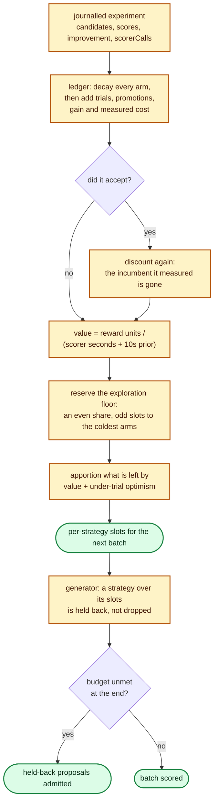

# Adaptive strategy allocation (issue #218)

Lamarck has always *measured* which strategy earns its cost — the journal names
the strategy behind every candidate and every accept — but it has never *acted*
on that measurement: nine strategies shared the candidate budget through fixed
opening quotas and a round-robin fill, however they performed.

This is the adaptive half. `--strategy-allocation adaptive` allocates each
strategy a share of the candidate budget from its **decayed, measured return**,
and `--strategy-allocation fixed` (the default) keeps the pre-#218 split as the
arm it is measured against.

The implementation is [`lamarck/src/strategy_allocation.rs`](../lamarck/src/strategy_allocation.rs),
the behavioural tests are
[`lamarck/tests/strategy_allocation.rs`](../lamarck/tests/strategy_allocation.rs),
and the generator-side tests live beside the generator in
[`lamarck/src/candidates.rs`](../lamarck/src/candidates.rs).

## What a strategy is worth

Reward is **authoritative full-corpus improvement per unit measured cost**,
never screen score. The screen is a 5% sample whose rank correlation with the
corpus is measured in [`docs/screen-calibration.md`](screen-calibration.md);
allocating a budget off it would fund whichever strategy is best at looking
good cheaply.

| Term | Where it comes from | Why |
|------|---------------------|-----|
| Score gain | `improvement` on an accepted experiment, credited to the winner's member strategies via `comboMemberIndices` | The only authoritative signal Lamarck has. A merged combo splits its Δ evenly across its members, so the ledger's total gain can never exceed what the run actually earned. |
| Promote conversions | Candidates of that strategy carrying a full-corpus score in `scores`, on an experiment that actually ran a screen phase | The only measured return available *before* the first accept. Worth `0.05` reward units each — a twentieth of clearing the accept bar — so it can break a tie but never outweigh a real improvement. A run with screening off promotes everything, so its "conversions" would credit every arm equally; the credit is withheld there rather than pretending to a signal (the promote cost is still charged). |
| Cost | The experiment's own `scorerCalls`: screen milliseconds shared across every candidate in the batch, promote and combo milliseconds shared across the candidates that were promoted | This is what a slot actually costs. A strategy that only ever screens is charged screen time; one that keeps promoting and failing is charged the ~11s/creature full-corpus calls it caused. Phase-0 and graft-replay calls score no candidate from the batch, so they are charged to nobody. |

Reward is expressed in multiples of `--min-improvement`, so the numbers stay
readable at a `1e-6` accept bar:

```text
reward_units = max(score_gain, 0) / min_improvement + 0.05 × promotions
value        = reward_units / (cost_seconds + 10)
```

A strategy that has cost time and returned nothing is worth **zero** — never
negative. A rejection is evidence about one proposal, not a debt, and a negative
value would be a licence to eliminate an arm rather than to defund it.

The `+ 10` is a shrinkage prior: ten scorer seconds of assumed silence, about
one full-corpus creature score on the production creature
([`docs/scorer-call-cost.md`](scorer-call-cost.md)). It prices a thin sample
honestly — one accept on two seconds of scorer time is not a rate anybody
should act on — and it is what makes **decay bite at all**. A bare
`reward / cost` ratio is scale-invariant, so discounting an arm's whole ledger
after an incumbent change would leave its value, and therefore its slots,
exactly where they were: the discount would be a no-op on the one decision it
exists to influence. Divided by `cost + prior`, a decayed arm converges on
zero, which is where an arm with no evidence already sits.

## How the slots are drawn



The reserve is exactly `floor × budget` whole slots, spread evenly; the
remainder of that division goes to the arms with the **fewest decayed trials**.
A 20% floor over nine arms and a 100-candidate budget therefore reserves 20
slots — two for every arm, and a third for the two coldest — leaving 80 to
allocate. What remains is apportioned by largest remainders, so the slots always
sum to the budget exactly.

Reserving for the coldest arms is what keeps the guarantee at *any* budget. A
large `--focus-count` splits the budget per focus, and a focus share can be
smaller than the arm count; no allocation can seat every arm at once there. The
reserve then rotates — the coldest arms take it, their trial counts rise, and
the next batch reserves for the next coldest — so every arm is reached within a
few batches instead of one, which is the honest form of the guarantee at that
budget and still the property that stops an arm going permanently unreachable.

The index each arm is apportioned on is its value plus a UCB-style bonus for
being under-tried:

```text
optimism = 1 accept-bar improvement / (mean cost seconds over the arms + 10)
index_i  = value_i + 0.5 × optimism × sqrt( ln(1 + Σ trials) / trials_i )
```

The optimism term is what a strategy would be worth if it earned **one**
improvement at the accept bar, priced against what the pool has been spending.
Both halves of that matter:

* **Not a constant.** `value` is a rate, so its scale depends on how much scorer
  time the arms have accumulated — tens of seconds in a unit test, hundreds on a
  100-candidate production batch. A bonus fixed at one scale swamps the measured
  value at the other, and the allocation stops tracking return at exactly the
  size it was built for.
* **Pool-average cost, not the arm's own.** An arm's own cost would make a cheap
  arm look promising simply for being cheap, and on a real batch every
  non-promoting arm is cheap — the optimism would outrank the one arm that
  actually earned something.
* **Cost, not value.** A bonus proportional to the pool's measured *value*
  cancels exactly against that value, so the split between a leader and the rest
  would be identical however far the ledger decayed.

With nothing tried at all the horizon is `ln(1) = 0`, every index is zero, and
the apportionment falls back to an **even split** — no strategy preferred on
evidence nobody has. That is not the same batch the fixed allocation would
generate: its opening quotas deliberately front-load structural probes, so
`structural_add` and `structural_add_neuron` take more than a ninth of a fixed
batch. Adaptive mode starts even and moves from there.

On a production-shaped ledger — 100 candidates, a ~100s screen call, a ~33s
promote call and one accept every fifth experiment — that puts the earning arm
at roughly **twice** the even share with every other arm still near it. The
reallocation is deliberately conservative: it concentrates as evidence
accumulates and gives the slots back when the evidence goes stale, which
`lamarck/tests/strategy_allocation.rs::measured_return_still_moves_slots_at_production_batch_sizes`
and `::decayed_evidence_gives_back_slots_it_won` pin from both directions.

## Why it cannot become a monoculture

The issue's guardrail is explicit: adaptive allocation, not winner-takes-all
elimination. Four things bound it, in the order they bind.

1. **The exploration floor** (`--strategy-exploration-floor`, default `0.2`).
   Reserved *before* value is consulted and spread evenly, odd slots to the
   coldest arms, so every enabled strategy keeps whole slots however well one is
   doing. Set it to `0` only for a deliberate pure-exploitation arm.
2. **The UCB bonus.** A cold arm is lifted towards one imagined accept-bar
   improvement, in proportion to how little it has been tried.
3. **Decay** (`--strategy-evidence-decay`, default `0.9`, half-life ≈ 7
   experiments) and an extra ×`0.25` whenever an accept replaces the incumbent.
   Evidence describes a creature that no longer exists the moment it accepts.
   Because value is shrunk by the prior, that discount reaches the *allocation*
   and not merely the ledger: an operator that stops earning gives its slots
   back, which
   [`lamarck/tests/strategy_allocation.rs`](../lamarck/tests/strategy_allocation.rs)
   asserts on the slot vector rather than on the evidence behind it.
4. **The generator never shortens a batch.** A proposal over its strategy's
   slots is *held back*, and admitted at the end if nothing fresher could fill
   the budget — the same contract mirrored sampling uses for a retired axis
   (issue #203). An allocation reorders a batch; it never scores a short one.
   The refill follows the allocation too: each leftover slot goes to the
   held-back proposal whose strategy is least over its share, so it cannot fall
   to whichever strategy the generator happens to propose first (always
   `structural_add`). Generation also stops as soon as the admitted and
   held-back proposals together cover the budget, so a binding allocation cannot
   make the generator sweep the whole ranked-source grid building candidates it
   has no room for.

A strategy the allocation does not name is **uncapped**, not silenced: an
allocation drawn over a different arm set (`--structural-only`, say) has said
nothing about it.

## What the journal and the report say

Each experiment under adaptive allocation carries a `strategyAllocation` object:
the `explorationFloor` in force, the `slots` each strategy was given, and the
`value` it was worth when they were drawn. A multi-focus experiment allocates
per focus and journals the slots summed across them. The run header records
`strategyAllocation` and `strategyEvidenceDecay` under both modes — the ledger
accumulates either way, and a report has to replay it with the decay the run
used — and `strategyExplorationFloor` only under `adaptive`, where something is
actually reserved.

`neat_ai_lamarck report` emits a `strategyAllocation` bucket for **every**
journal, fixed and adaptive alike, so the two A/B arms are read off the same
numbers:

| Field | Meaning |
|-------|---------|
| `mode`, `explorationFloor`, `evidenceDecay` | The knobs from the run header. |
| `allocatedExperiments` | Experiments that recorded an allocation (`0` under fixed). |
| `strategies[].allocatedSlots` | Slots the strategy was given across the journal. |
| `strategies[].trials` | Candidates it contributed to a scored batch. |
| `strategies[].promotions` | Candidates that converted from screen to full-corpus. |
| `strategies[].accepts`, `scoreGain` | Accepted improvements and the Δ credited to it. |
| `strategies[].costMs` | Scorer milliseconds its candidates caused. |
| `strategies[].estimatedValue` | Decayed reward units per scorer second at the end of the journal. |

`estimatedValue` is computed by replaying the journal through the same ledger
the run used, so a report never disagrees with the allocation it describes.

## The A/B

The gate metric is the one #69 and #94 already use:
`scoreImprovementPerWallHour` from `neat_ai_lamarck report` (full-corpus
anchored — do not pass `--skip-phase0`, which leaves it `null`).

```bash
cargo build --release
CREATURE=… TRAIN_DATA=… SCORER=… \
scripts/run-strategy-allocation-ab.sh            # control (fixed) + adaptive, per seed
scripts/summarise-strategy-allocation.sh .lamarck-strategy-allocation
```

Both arms share a seed, so the focus stream and the opening quotas start
identical and only the allocation moves. Repeats are required: on a creature
where accepts are rare, one pair is an anecdote — the #75 campaign's own
ordering reversed between two samples
([`docs/followup-economics.md`](followup-economics.md)).

### Status: not yet run

**No production A/B has been run for this feature.** It needs exclusive time on
a box with the private production corpus, which this repository does not carry,
so the comparison is set up and unrun rather than reported here. Until it is
run:

* `--strategy-allocation fixed` stays the default. Nothing about an untouched
  run changed.
* The measured claims in this document are about the *mechanism* — reward,
  cost, decay, the floor — every one of which is covered by the tests named at
  the top. There is no claim here about improvement per wall hour, because none
  has been measured.
