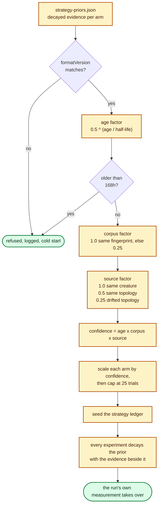

# Transferable operator priors (issue #221)

Lamarck runs are deliberately short: the champion each run is handed goes stale,
so a 45-minute budget is spent against a creature that is still current. The
cost of that choice is that **every run re-discovers which mutation families are
currently productive**, from scratch, even though the journals of earlier runs
already measured it — against a different incumbent, but with the same
operators.

`--strategy-priors seed` carries the operator-level half of that knowledge
forward. `--strategy-priors off` — the default — starts cold and is the arm the
seeded run is measured against.

The implementation is [`lamarck/src/strategy_priors.rs`](../lamarck/src/strategy_priors.rs),
the behavioural tests are
[`lamarck/tests/strategy_priors.rs`](../lamarck/tests/strategy_priors.rs), and
the ledger the priors seed is
[`lamarck/src/strategy_allocation.rs`](../lamarck/src/strategy_allocation.rs)
([`docs/strategy-allocation.md`](strategy-allocation.md)).

## What travels, and what cannot

The file holds one decayed [`StrategyEvidence`] row per strategy and nothing
else:

| Field | Meaning | What it derives |
|-------|---------|-----------------|
| `trials` | Candidates the strategy contributed to a scored batch | The denominator of every rate below |
| `promotions` | Candidates that converted from screen to a full-corpus promote | Screen-to-promote precision, `promotions / trials` |
| `accepts` | Accepted full-corpus improvements credited to it | Promote-to-accept precision, `accepts / promotions` |
| `scoreGain` | Accepted full-corpus Δ credited to it | Cost per useful candidate, `costMs / accepts`; gain per scorer second |
| `costMs` | Scorer milliseconds its candidates caused | — |

There is **no creature, no mutation description, no focus neuron and no
scalar**, so no historical candidate can be replayed even in principle. That is
the guardrail #221 asks for, and it is held by construction rather than by a
check somewhere downstream: the format cannot replay an old edit because it does
not carry one. Every
candidate a seeded run scores is generated, screened and promoted exactly as it
would be on a cold start — priors move *slots*, never a gate.

It is also what makes the file portable. The only identity in it is a coarse
shape id (`in2-out1-n3-s4`, which describes no application) and two opaque
`u64` fingerprints, so a prior can be moved between machines without carrying
private metadata off one.

```json
{
  "formatVersion": "1.0.0",
  "writtenUnix": 1800000000,
  "minImprovement": 1e-6,
  "source": { "incumbentId": "in2-out1-n3-s4", "creatureFingerprint": 11, "trainingKey": 22 },
  "arms": {
    "structural_add": { "trials": 24.1, "promotions": 3.2, "accepts": 1.4, "scoreGain": 6.1e-6, "costMs": 61000.0 }
  }
}
```

`formatVersion` is the compatibility gate: a file of any other version is
refused with the reason logged, and the run starts cold rather than misreading
old bytes.

## How far a prior is trusted



Three independent discounts multiply into one confidence in `[0, 1]`:

* **Age** — `0.5 ^ (age hours / --strategy-priors-half-life-hours)`, default
  half-life 24h, and exactly **zero** past the 168h (7-day) maximum age. The
  half-life alone only ever approaches zero; the hard bound is what makes
  "maximum age" a number rather than an adjective, and it matches the
  failed-candidate cache's own week
  ([`docs/failed-candidate-cache-economics.md`](failed-candidate-cache-economics.md)).
* **Corpus** — the training-corpus fingerprint
  ([`docs/baseline-reuse.md`](baseline-reuse.md) uses the same one) must match,
  or the evidence keeps `0.25`. Not zero: which families propose anything
  scorable is a property of the creature and the generator as much as of the
  data. Not much more: the gains behind the evidence were measured over records
  this run will not see. A corpus that could not be fingerprinted at **either**
  end counts as a mismatch — unconfirmed is not confirmed.
* **Source creature** — the same creature keeps `1.0`; the same topology with
  different weights keeps `0.5` (the ordinary case: a run seeded by yesterday's
  champion); a drifted topology keeps `0.25`, because a structural accept
  changes which operators can even apply.

The scaled evidence is then **capped at 25 trials per arm**, scaling the whole
row together so a capped prior keeps its measured *rate* and loses only its
weight. Twenty-five trials is about a quarter of one production batch: enough to
move the opening allocation, far too little to hold it.

## Why the current run wins quickly

Nothing special happens to make fresh evidence dominate — the ledger's ordinary
decay does it. Every experiment scales **every** arm by
`--strategy-evidence-decay` (default `0.9`) before adding what it measured, and
an accept discounts the whole ledger again by `0.25`. A prior therefore holds
`0.9^n` of its opening mass after `n` experiments while the run's own evidence
accumulates undiscounted at the front, so the prior's share of an arm's standing
falls geometrically:
[`lamarck/tests/strategy_priors.rs`](../lamarck/tests/strategy_priors.rs)`::current_run_evidence_overrides_a_stale_prior_within_a_few_experiments`
pins that at five experiments against a prior seeded at full confidence.

Two guardrails from #218 are untouched and still bind: the exploration floor is
reserved before any value — prior or fresh — is consulted, and the UCB bonus
still lifts the arms tried least.

## What the journal and the report say

A seeded run writes one `strategyPriors` line before its first experiment,
**including when it seeded nothing** — a run whose priors were refused must not
be indistinguishable from the cold-start arm it is measured against:

| Field | Meaning |
|-------|---------|
| `formatVersion`, `writtenUnix` | Which file was read, and when it was written. |
| `confidence` | The applied `confidence` and the `age` / `corpus` / `source` factors behind it, plus `ageHours`. |
| `seeded` | The evidence actually folded in, per strategy label. |
| `unknownArms` | Arm labels this build does not recognise — a file written by a newer Lamarck. |
| `rejected` | Why nothing was seeded, when a file was present but unusable. |

The run header records `strategyPriors` under both modes and
`strategyPriorsHalfLifeHours` under `seed`.

`neat_ai_lamarck report` folds that line back into the same ledger the run used
and reports the split:

| Field | Meaning |
|-------|---------|
| `strategyAllocation.priorsMode` | `off` / `seed`, from the run header. |
| `strategyAllocation.priors` | `formatVersion`, `ageHours`, `confidence`, `ageConfidence`, `corpusConfidence`, `sourceConfidence`, `seededTrials`, `seededArms`, `rejected`. `null` on a cold-start journal — "started cold" and "seeded nothing" are different runs. |
| `strategies[].priorTrials` | Trials the arm inherited, counted apart from the `trials` this journal's experiments measured. |
| `strategies[].priorShare` | Share of the arm's decayed trials still coming from the prior — how much of the allocator's current opinion was inherited rather than earned. |

## The A/B

The gate metric is the one #69, #94 and #218 already use:
`scoreImprovementPerWallHour` from `neat_ai_lamarck report` (full-corpus
anchored — do not pass `--skip-phase0`, which leaves it `null`).

```bash
cargo build --release
CREATURE=… TRAIN_DATA=… SCORER=… \
scripts/run-strategy-priors-ab.sh              # cold-start control + prior-seeded arm, per seed
scripts/summarise-strategy-priors.sh .lamarck-strategy-priors
```

The seeded arm is run **twice** per seed against one priors file: the first run
has no history to read and writes what it measured, and the second is the one
the comparison is about. Both arms share a seed, and the control never reads or
writes priors, so the only difference at the second run is the ledger each arm
opens with.

### Status: not yet run

**No production A/B has been run for this feature.** It needs exclusive time on
a box with the private production corpus, which this repository does not carry,
so the comparison is set up and unrun rather than reported here. Until it is
run:

* `--strategy-priors off` stays the default. Nothing about an untouched run
  changed — no file is read, and none is written.
* The measured claims in this document are about the *mechanism* — the format,
  the confidence discounts, the cap and the decay — every one of which is
  covered by the tests named at the top. There is no claim here about
  improvement per wall hour, because none has been measured.

[`StrategyEvidence`]: ../lamarck/src/strategy_allocation.rs
